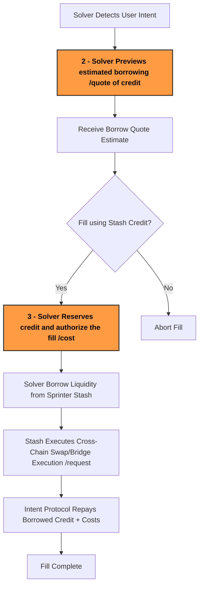

:::tip
Request your Stash API key via [Sprinter Stash Request](https://forms.gle/kgpcQK722Ley2gke7) or contacting support@sprinter.tech
:::

## For crosschain DeFi

Sprinter Stash enables solvers to **borrow crosschain credit on-demand** to execute user intents without needing pre-funded inventory.

## Overview of the Stash Fill Lifecycle

<div style={{ display: "flex", justifyContent: "center" }}>



</div>

## How Stash Enables Zero-Collateral Loans

Sprinter Stash enables solvers to borrow liquidity with near zero collateral, and achieves this through a series of mechanisms below:

#### 1. Approved Solvers

On launch only approved solvers can access Stash credit. These solvers:

- Undergo screening and onboarding by the Sprinter team
- Must use authenticated API keys tied to their accounts
- Are rate-limited and monitored to ensure responsible usage

Sprinter also tracks solver performance and creditworthiness over time. Solvers who consistently repay on time may be granted higher limits, while misbehavior results in penalties or revoked access with both informed through regular reviews of:

- Fill accuracy and repayment behavior
- Volume solved and protocols interacted with
- On-chain and off-chain repayment events

#### 2. Transaction-Level Guarantees

Each fill is validated against the user’s original intent using:

- Verified source deposits (e.g. via Across)
- MPC-signed authorization signatures
- Controlled function execution (via calldata)

Sprinter acts as an intermediary: the solver never touches user funds directly. The system ensures that repayment is guaranteed by the user's transaction on the source chain before the solver receives liquidity.

#### 3. Protocol Guardrails & Limits

Sprinter enforces:

- Per-solver daily limits (to minimize exposure)
- Per-transaction liquidity caps
- Circuit breakers triggered by irregular repayment behavior
- Slashing (or bond requirements) for higher-risk integrations

## Stash Fees

Sprinter Stash handles crosschain liquidity fills. Revenue is generated from the spread between between the amount the user deposited on source and the amount provided on the destination.

### Revenue Components

- **Fill Revenue:** Amount user deposits on source - amount send to user on destination
- **Borrow Costs:** Cost of liquidity borrowing and crosschain repayment.
- **Solver Costs:** Gas fees and execution costs fronted by solvers.

### Profit Calculation

```
Fill Profit = Fill Revenue - Borrow Costs - Solver Costs
```

### Monthly Distribution

1. Withdraw raw profits from liquidity pools.
2. Deduct solver gas costs.
3. Distribute monthly fill profits to:

| Actor    | Description                           | Fill Profit % |
| -------- | ------------------------------------- | ------------- |
| Solvers  | For executing fills                   | 50%           |
| LPs      | For providing liquidity               | 50%           |
| Treasury | Protocol growth & sustainability fund | TBD           |

➡️ _Initial fee split is reviewed monthly by governance._
