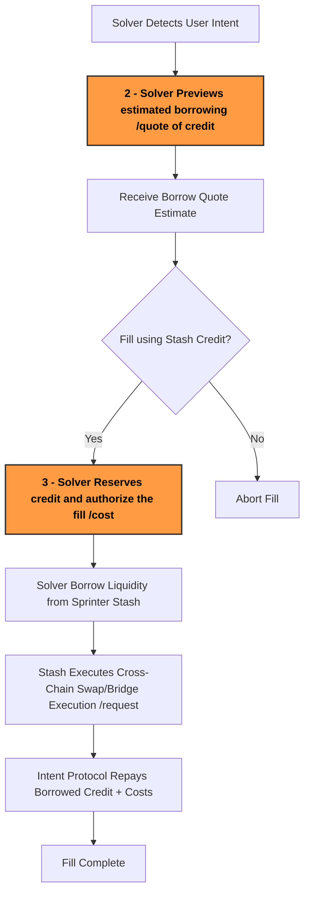

:::tip
Request your Stash API key via [Sprinter Stash Request](https://forms.gle/kgpcQK722Ley2gke7) or contacting support@sprinter.tech
:::

## As a Solver

Sprinter Stash enables solvers to **borrow crosschain credit on-demand** to execute user intents without needing pre-funded inventory.

This guide covers:

1. Recap of the [Stash Fill Lifecycle](use-stash#1-stash-solver-fill-lifecycle)
2. Requesting a [Credit Borrow Quote Estimate](use-stash#2-request-a-credit-borrow-quote-estimate-optional)
3. Requesting a [Final Borrow Cost and Credit Authorization](use-stash#3-request-the-final-credit-borrow-cost)
4. Check out the [Fill Optimization Tips](use-stash#4-fill-optimization-tips)

### 1. Stash Fill Lifecycle

<div style={{ display: "flex", justifyContent: "center" }}>



</div>

### 2. Request a Credit Borrow Quote Estimate (Optional)

Call the [**Borrow Quote API**](borrow-quote-api) to preview an estimated borrowing cost for a potential fill before requesting credit. This can be based on input or output amount.

```ts title="Request Borrow Quote Estimate with type ExactInput (input amount - borrow costs)"
const baseUrl = "https://api.sprinter.tech";
const sourceChainId = "eip155:8453"; // eip155:8453(Base), eip155:10 (Optimism), eip155:42161 (Arbitrum). ChainId must use capid format from our configuration
const protocol = "across"; // "across" or "mayan"
const type = "ExactInput"; // Request will consider the amount as (input amount - borrow costs)
const amount = 10000000; // This is the ExactInput eg 1 USDC (6 decimals)
const response = await fetch(
  `${baseUrl}/liquidity/chain/${sourceChainId}/protocol/${protocol}/type/${type}/quote`,
  {
    method: "GET",
    headers: {
      "X-Auth-Token": "<your_api_key>",
    },
    body: {
      amount: amount,
      token: "destination_token_address", // Token address
      network: "eip155:10", // Destination_Chain_ID
    },
  },
);

const borrowQuote = await response.json();
console.log("Expected amount:", borrowQuote.expectedOutput);
console.log("Borrow Cost:", borrowQuote.borrowCost);
```

```ts title="Request Final Borrow Quote Estimate with type ExactOutput (output amount + borrow costs)"
const baseUrl = "https://api.sprinter.tech";
const sourceChainId = "eip155:8453"; // eip155:8453(Base), eip155:10 (Optimism), eip155:42161 (Arbitrum). ChainId must use capid format from our configuration
const protocol = "across"; // "across" or "mayan"
const type = "ExactOutput"; // Request will consider the amount as (output amount + borrow costs)
const amount = 10000000; // This is the ExactInput eg 1 USDC (6 decimals)
const response = await fetch(
  `${baseUrl}/liquidity/chain/${sourceChainId}/protocol/${protocol}/type/${type}/quote`,
  {
    method: "GET",
    headers: {
      "X-Auth-Token": "<your_api_key>",
    },
    body: {
      amount: amount,
      token: "destination_token_address", // Token address
      network: "eip155:10", // Destination_Chiain_ID
    },
  },
);

const borrowQuote = await response.json();
console.log("Expected Input:", borrowQuote.requiredInput);
console.log("Borrow Cost:", borrowQuote.borrowCost);
```

### 3. Request the final Credit Borrow Cost

If proceeding to fill with Sprinter Stash, call the [**Borrow Cost API**](borrow-cost-api) to request the final borrow cost to reserve credit and authorize the fill.

```ts title="Fetch Borrow Cost Example Payload"
const baseUrl = "https://api.sprinter.tech";
const destChainId = "eip155:8453"; // eip155:8453(Base), eip155:10 (Optimism), eip155:42161 (Arbitrum) destChainId must use capid format from our configuration
const protocol = "across"; // "across" or "mayan"
const txHash = "string"; // Source chain deposit TX
const response = await fetch(
  `${baseUrl}/liquidity/chain/${destChainId}/protocol/${protocol}/deposit/${txHash}/requests`,
  {
    method: "GET",
    headers: {
      "X-Auth-Token": "<your_api_key>",
    },
    body: {
      input: "callData", // encoded callData for destination ( Borrow & Fill) it also contains depositData prams for MPC validation
      caller: "address", // the address that will execute the borrow and fill ond destChainId
    },
  },
);
```

### 4. Fill Optimization Tips

Here are some tips on getting the best performance and profit from your Sprinter Stash integration:

1. **Pre-fetch Borrow Cost** - Call `GET /type/{type}/quote` as early as possible (when detecting intents) to evaluate solver profitability.

2. **Batch Gas Where Possible** - Bundle execution and repayment transactions to reduce gas costs.

3. **Optimize for Slippage** - Query quotes close to execution time to reduce stale pricing or slippage-induced fills.

4. **Handling Rate Limits** - If you hit 429s, give it a moment and retry using retry_after value. You can request higher limits via support@sprinter.tech.

5. **Validate Transaction Hash Early** - Ensure the user intent transaction is final and not reverted before calling `/deposit/{txHash}/request`.
