:::tip
Request your Stash API key via [Sprinter Stash Request](https://forms.gle/kgpcQK722Ley2gke7) or contacting support@sprinter.tech
:::

## As a Solver

Sprinter Stash enables solvers to **borrow liquidity crosschain on-demand** to execute user intents without needing pre-funded inventory.

This guide covers:
 
1. Recap of the [**Stash Fill Lifecycle**](use-stash#1-stash-fill-lifecycle)
2. Requesting a [**Borrow Cost Estimate**](use-stash#1-request-a-borrow-cost-estimate-optional)
3. Requesting a **Final Borrow Quote and Liquidity Authorization**

### 1. Stash Fill Lifecycle

```mermaid
flowchart TD
  A[Detect User Intent] --> B[2 - Preview an estimated borrowing cost🔗]
  B --> C[Receive Borrow Cost Estimate]
  C --> D{Is Cost Acceptable?}
  D -- Yes --> E[3 - Reserve liquidity and authorize the fill🔗]
  D -- No --> F[Abort Fill]
  E --> G[Borrow Liquidity from Sprinter Stash]
  G --> H[Perform Cross-Chain Swap/Bridge Execution]
  H --> I[Repay Borrowed Liquidity + Costs]
  I --> J[Fill Complete]

click B "borrow-cost-api" "Borrow Cost"
style B fill:#FF9B43,stroke:#333,stroke-width:2px,color:#000,font-weight:bold

click E "borrow-quote-api" "Borrow Quote"
style E fill:#FF9B43,stroke:#333,stroke-width:2px,color:#000,font-weight:bold

```


<div style={{ display: "flex", justifyContent: "center" }}>


</div>


### 2. Request a Borrow Cost Estimate (Optional)

Call the [**Borrow Cost API**](borrow-cost-api) to preview an estimated [borrowing cost](/glossary#46-borrow-cost)) for a potential fill before requesting liquidity. 


```ts title="Fetch Borrow Cost Estimate"
const protocol = "across";  // Example: "across", "uniswapx"
const type = "swap";        // Example: "swap", "bridge"

const response = await fetch(
  `https://api.sprinter.tech/v1/liquidity/protocol/${protocol}/type/${type}/quote`,
  {
    method: "GET",
    headers: {
      "Content-Type": "application/json",
      "X-API-Key": "<your_api_key>",
    },
  }
);

const costEstimate = await response.json();
console.log("Borrow Cost Estimate:", costEstimate);
 ```


###  3. Request a Final Borrow Quote

If the estimated cost is acceptable, call the [**Borrow Quote API**](borrow-quote-api) to request a [borrow quote](/glossary#47-borrow-quote) to reserve liquidity and authorize the fill.

```ts title="Request Final Borrow Quote"
const protocol = "across";
const txHash = "0xabc123"; // Related transaction hash

const response = await fetch(
  `https://api.sprinter.tech/v1/liquidity/protocol/${protocol}/deposit/${txHash}/request`,
  {
    method: "GET",
    headers: {
      "Content-Type": "application/json",
      "X-API-Key": "<your_api_key>",
    },
  }
);

const borrowQuote = await response.json();
console.log("Borrow Quote:", borrowQuote);
```