:::tip
Ready to **Stash**? Visit out the [Stash API quick start guide](use-stash)
:::

# Sprinter Stash

Sprinter's crosschain credit protocol providing liquidity access to solvers and market makers without requiring collateral.

## How Stash Works

- **Liquidity Providers** deposit USDC into **[Stash](https://app.sprinter.tech)**, earning yield from solver fees, passive yield and protocol incentives.
- Stash **dynamically allocates liquidity** across supported chains based on solver demand using algorithmic management and rebalancing.
- **Solvers** request and borrow liquidity on destination instantly, [without collateral](#how-stash-enables-zero-collateral-loans), enabling seamless crosschain execution.
- Once **fills are completed**, Stash receives funds on the source chain, repays the credit, and distributes profits to LPs and solvers.

### Stash Fill Lifecycle

```mermaid
flowchart TD
  A[Detect User Intent] --> B[Preview an estimated borrowing cost🔗]
  B --> C[Receive Borrow Cost Estimate]
  C --> D{Is Cost Acceptable?}
  D -- Yes --> E[Reserve liquidity and authorize the fill🔗]
  D -- No --> F[Abort Fill]
  E --> G[Borrow Liquidity from Sprinter Stash]
  G --> H[Perform Cross-Chain Swap/Bridge Execution]
  H --> I[Repay Borrowed Liquidity + Costs]
  I --> J[Fill Complete]

click B "borrow-cost-api" "Borrow Cost"
style B fill:#FF9B43,stroke:#333,stroke-width:2px,color:#000,font-weight:bold

click E "borrow-quote-api" "Borrow Quote"
style E fill:#FF9B43,stroke:#333,stroke-width:2px,color:#000,font-weight:bold

```



## Features & Utility

### For Liquidity Providers

- Earn passive yield, solver-generated fees and protocol incentives.
- Participate in liquidity mining campaigns for SPRNT rewards.
- Benefit from protocol-managed inventory strategies.

### For Solvers

- Reduce capital requirements by borrowing liquidity on demand.
- Eliminate need to manage inventory across chains.
- Improve execution efficiency with shared liquidity access.

### How Stash Enables Zero-Collateral Loans

Sprinter Stash enables solvers to borrow liquidity with near zero collateral, and achieves this through a series of mechanisms below:

#### 1. Approved Solvers

On launch only approved solvers can access Stash credit. These solvers:

- Undergo screening and onboarding by the Sprinter team
- Must use authenticated API keys tied to their accounts
- Are rate-limited and monitored to ensure responsible usage

Sprinter also tracks solver performance and creditworthiness over time. Solvers who consistently repay on time may be granted higher limits, while misbehavior results in penalties or revoked access with both informed through regular reviews of:

- Fill accuracy and repayment behavior
- Volume solved and protocols interacted with
- On-chain and off-chain repayment events

#### 2. Transaction-Level Guarantees

Each fill is validated against the user’s original intent using:

- Verified source deposits (e.g. via Across)
- MPC-signed authorization signatures
- Controlled function execution (via calldata)

Sprinter acts as an intermediary: the solver never touches user funds directly. The system ensures that repayment is guaranteed by the user's transaction on the source chain before the solver receives liquidity.

#### 3. Protocol Guardrails & Limits

Sprinter enforces:

- Per-solver daily limits (to minimize exposure)
- Per-transaction liquidity caps
- Circuit breakers triggered by irregular repayment behavior
- Slashing (or bond requirements) for higher-risk integrations

#### 4. Bonding Pools

Sprinter will also allow Solver Operators to create Bonding Pools, that escrow funds to vouch for their solvers, enabling more favourable borrowing conditions. Sprinter Bonding Pools will be controlled by governance and similarly allow slashing by governance for any malicious activity or violations.

### Supported Networks

- Arbitrum
- Optimism
- Base
- Ethereum Mainnet (coming soon)

### Supported Assets

- Stablecoins: USDC, DAI, USDT
- Blue-Chip: WETH, WBTC

Want to request support for a new chain or asset? [Submit a request](https://forms.gle/an5vZrmyDkyYR8Ni7).

## Stash Fees

Sprinter Stash handles crosschain liquidity fills. Revenue is generated from the spread between between the amount the user deposited on source and the amount provided on the destination.

### Revenue Components

- **Fill Revenue:** Amount user deposits on source - amount send to user on destination
- **Borrow Costs:** Cost of liquidity borrowing and crosschain repayment.
- **Solver Costs:** Gas fees and execution costs fronted by solvers.

### Profit Calculation

```
Fill Profit = Fill Revenue - Borrow Costs - Solver Costs
```

### Monthly Distribution

1. Withdraw raw profits from liquidity pools.
2. Deduct solver gas costs.
3. Distribute monthly fill profits to:

| Actor    | Description                           | Fill Profit % |
| -------- | ------------------------------------- | ------------- |
| Solvers  | For executing fills                   | 50%           |
| LPs      | For providing liquidity               | 50%           |
| Treasury | Protocol growth & sustainability fund | TBD           |

➡️ _Initial fee split is reviewed monthly by governance._
