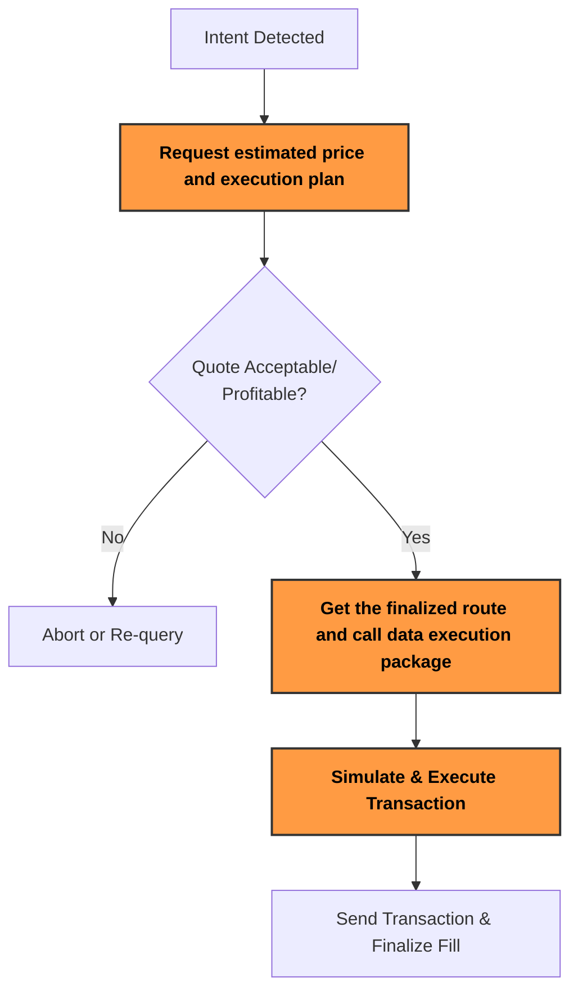

:::tip
Request your Solve API key to start your integration via [Sprinter Solve Request](https://forms.gle/TCAUwcYqguQbWi3bA) or contacting support@sprinter.tech
:::

Sprinter Solve enables your dApp, aggregator or protocol integration to **optimize swap execution via intent fulfillment**.

This guide covers:

1. Recap of the [Sprinter Solve Lifecycle](solve-api-quick-start#1-solve-lifecycle)
2. Requesting the estimated price and execution plan
3. Geting the finalized route and call data execution package
4. Send transaction using `swap_call_data`
5. Sprinter Solve Execution Tips

## 1. Solve Lifecycle

<div style={{ display: "flex", justifyContent: "center" }}>



</div>

## 2. Requesting the estimated price and execution plan

For lighter integration or quote pre-fetching, call the [**Get Quote API**](solve-get-quote) to request the estimated price and execution plan before retrieving call data.

```ts title="Example Fetch Quote Request"
cconst srcToken = "0xA0b86991c6218b36c1d19d4a2e9eb0ce3606eb48"; // USDC on Base
const dstToken = "0x4200000000000000000000000000000000000006"; // WETH on Base
const amount = "1000000"; // 1 USDC (6 decimals)

const url = new URL("https://api.sprinter.tech/v1/solve/quote");
url.searchParams.append("fromToken", srcToken);
url.searchParams.append("toToken", dstToken);
url.searchParams.append("amount", amount);
url.searchParams.append("fromChainId", "8453"); // Base
url.searchParams.append("toChainId", "1");      // Ethereum Mainnet

const response = await fetch(url, {
  headers: {
    "X-API-Key": "<your_api_key>",
  },
});

const quote = await response.json();
console.log("Solve Quote:", quote);
```

## 3. Geting the finalized route and call data execution package

Calling the [**Get Route API**](solve-get-route-v2) returns the finalized route, including call data, gas estimates and token out amounts. Use this executable call data `swap_call_data` after verifying a quote.

- **Mainnet:** `https://swaps.sprinter.tech/mainnet`
- **Base:** `https://swaps.sprinter.tech/base`

```ts title="Example Fetch Quote Request"
const chainId = 1; // 1 = Ethereum, 8453 = Base, etc.
const srcToken = "0xA0b86991c6218b36c1d19d4a2e9eb0ce3606eb48"; // USDC on Base
const dstToken = "0x4200000000000000000000000000000000000006"; // WETH on Base
const amount = "1000000"; // 1 USDC (6 decimals)
const userAddress = "0xYourUserAddress"; // End-user or caller's address

const response = await fetch("https://swaps.sprinter.tech/base/v2/route", {
  method: "POST",
  headers: {
    "Content-Type": "application/json",
    "X-API-Key": "<your_api_key>",
  },
  body: JSON.stringify({
    fromToken: srcToken,
    toToken: dstToken,
    amount: amount,
    slippage: 0.005, // 0.5% slippage tolerance
    user: "<user_address>",
  }),
});

const route = await response.json();
console.log("Route:", route);
```

## 4. Send transaction using `swap_call_data`

Once you've received a valid route from `/v2/route`, you'll use the `swap_call_data` in a transaction to execute the intent on-chain.

Below is a simplified example using `ethers.js` to send the transaction from a connected signer:

```ts title="Execute Route"
import { ethers } from "ethers";

const provider = new ethers.JsonRpcProvider("https://mainnet.base.org"); // or OP/Arbitrum
const signer = new ethers.Wallet("<PRIVATE_KEY>", provider);

const routeResponse = await fetch("https://swaps.sprinter.tech/base/v2/route", {
  method: "POST",
  headers: {
    "Content-Type": "application/json",
    "X-API-Key": "<your_api_key>",
  },
  body: JSON.stringify({
    fromToken: "USDC",
    toToken: "ETH",
    amount: "1000000",
    fromChainId: 8453,
    toChainId: 1,
    intentType: "swap",
  }),
});

const route = await routeResponse.json();

// Send the calldata to the target contract (Sprinter Router or intent receiver)
const tx = await signer.sendTransaction({
  to: route.to, // usually the router or intent execution contract
  data: route.swap_call_data,
  value: route.value || 0, // only include if route requires native gas
  gasLimit: route.gasEstimate + 50000, // add buffer
});

console.log("Transaction hash:", tx.hash);
```

## 5. Sprinter Solve Execution Tips

1. Start with `/quote` to quickly evaluate whether a fill is profitable.

2. Use tools like Tenderly or hardhat to **simulate calldata before execution**.

3. **Pay attention to slippage** - Quotes expire quickly. Re-query /route before execution if delayed.

4. Use **gasEstimate for accurate costing** - whilst the Route API provides gas estimates — apply buffer when setting gas limits.

5. **Handling Rate Limits** - If you hit 429s, give it a moment and retry using retry_after value. You can request higher limits via support@sprinter.tech.
