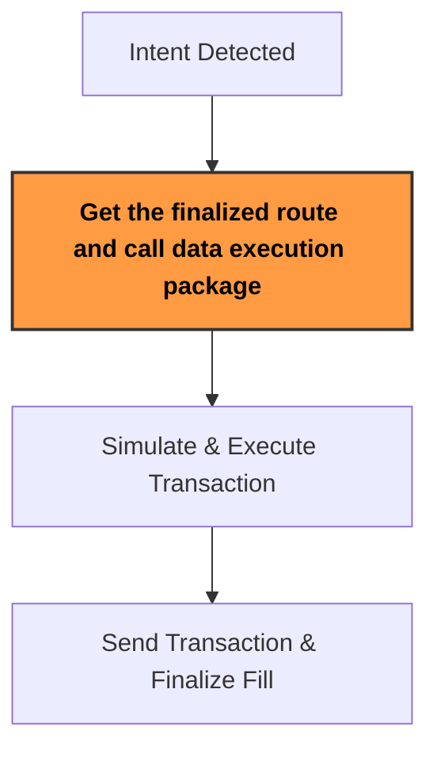

:::tip
Request your Solve API key to start your integration via [Sprinter Solve Request](https://forms.gle/TCAUwcYqguQbWi3bA) or contacting support@sprinter.tech
:::

Sprinter Solve enables your dApp, aggregator or protocol integration to **optimize swap execution via intent fulfillment**.

This guide covers:

1. Recap of the [Sprinter Solve Lifecycle](solve-api-quick-start#1-solve-lifecycle)
2. Geting the [finalized route and call data execution package](solve-api-quick-start#2-geting-the-finalized-route-and-call-data-execution-package)
3. Send transaction using [`swap_call_data`](solve-api-quick-start#3-send-transaction-using-swap_call_data)
4. Sprinter Solve [Execution Tips](solve-api-quick-start#4-sprinter-solve-execution-tips)

## 1. Solve Lifecycle

<div style={{ display: "flex", justifyContent: "center" }}>



</div>

## 2. Geting the finalized route and call data execution package

Calling the [**Get Route API**](solve-get-route-v1) returns the finalized route, including call data, gas estimates and token out amounts. Use this executable call data `swap_call_data` after verifying a quote.

- **Mainnet:** `https://swaps.sprinter.tech/mainnet`
- **Base:** `https://swaps.sprinter.tech/base`

```ts title="Example Fetch Quote Request Payload"
const AMOUNT_IN; // the amount of token that you want exchange in their decimals denomination
const TOKEN_IN_ADDRESS; // token_in_address
const TOKEN_OUT_ADDRESS; // token_out_addres - tokens that you want to receieve
const SLIPPAGE; // the slipapge that you want to allow for the swap ( 0.5 - 2%)
const TARGET_DURATION;

const fetchRoute = async () => {
  const response = await fetch(
    "https://swaps.sprinter.tech/mainnet/v2/route?amount_in=[AMOUNT_IN]&token_in=[TOKEN_IN_ADDRESS]&token_out=[TOKEN_OUT_ADDRESS]&slippage=[SLIPPAGE]&target_duration_ms=[TARGET_DURATION]",
    {
      method: "GET",
      headers: {
        "X-API-Key": "your_api_key_here",
      },
    },
  );

  const data = await response.json();
  return data;
};
```

## 3. Send transaction using `swap_call_data`

Once you've received a valid route from `/v1/route`, you'll use the `swap_call_data` in a transaction to execute the intent on-chain.

Below is a simplified example using `ethers.js` to send the transaction from a connected signer:

```ts title="Example Execute Route Payload"
import { ethers } from "ethers";

const provider = new ethers.JsonRpcProvider("https://mainnet.base.org"); // or OP/Arbitrum
const signer = new ethers.Wallet("<PRIVATE_KEY>", provider);

const routeResponse = await fetch("https://swaps.sprinter.tech/base/1/route", {
  method: "POST",
  headers: {
    "Content-Type": "application/json",
    "X-API-Key": "<your_api_key>",
  },
  body: JSON.stringify({
    fromToken: "USDC",
    toToken: "ETH",
    amount: "1000000",
    fromChainId: 8453,
    toChainId: 1,
    intentType: "swap",
  }),
});

const route = await routeResponse.json();

// Send the calldata to the target contract (Sprinter Router or intent receiver)
const tx = await signer.sendTransaction({
  to: route.to, //  the router or intent execution contract eg. 0xbfc4b3546416c5a7fa857bdb31b7701bfc7a42f7 for Sprinter Solve (Mainnet, Base)
  data: route.swap_call_data,
  value: route.value || 0, // only include if route requires native gas
  gasLimit: route.gasEstimate + 50000, // add buffer
});

console.log("Transaction hash:", tx.hash);
```

## 4. Sprinter Solve Execution Tips

1. Use tools like Tenderly or hardhat to **simulate calldata before execution**.

2. **Pay attention to slippage** - Quotes expire quickly. Re-query /route before execution if delayed.

3. Use **gasEstimate for accurate costing** - whilst the Route API provides gas estimates — apply buffer when setting gas limits.

4. **Handling Rate Limits** - If you hit 429s, give it a moment and retry using retry_after value. You can request higher limits via support@sprinter.tech.
