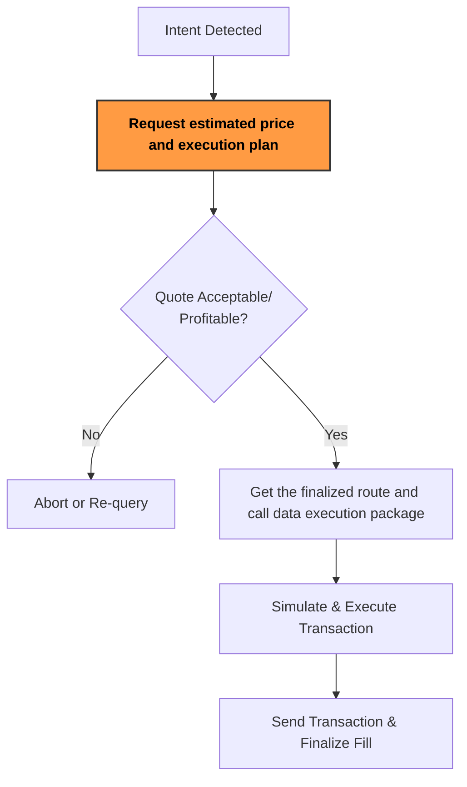

:::tip
Ready to start your **Solve integration**? Check out the [Solve API quick start guide](solve-api-quick-start)
:::

# Sprinter Solve

Sprinter Solve enables the efficient execution of intent-based Swaps through its Solve API (RFQ and Swap), powered by the Sprinter Solver, built on top of the Project Blanc solver. It provides:

- **Best Price:** Finds optimal routes and prices with MEV protection and low slippage.
- **Fast Integration:** Dedicated API that can be integrated in hours.
- **Crosschain Liquidity:** Leverages Sprinter Stash for real-time liquidity allocation.
- **Zero Collateral:** Solvers execute transactions without upfront capital.
- **Support:** 24/7 support with flexible SLAs.

## How Solve Works



## Key Features & Utility

### For dApps & Wallets

dApps and wallets can easily interface with the Solve API to:

- Enable seamless swaps and crosschain execution for users.
- Improve transaction reliability and reduce slippage.
- Integrate directly with the Solver API for superior UX.

### For Intent-Based Protocols

Seamlessly integrate our solver into intent-based protocols for:

- Best-In-class intent execution for your protocol across swaps, crosschain and complex Intents
- Improve fulfillment rates across chains.
- Fast Solver onboarding via dedicated protocol integration or ERC-7683 compliant interface
- Day 1 support for new protocol launches

Feel free to contact us at hello@sprinter.tech to see how we can help your intent protocol.

## Solve Fees

When a fixed user fee is applied through Sprinter API, revenue is shared with partners based on usage volume.

### Fee Discount Tiers

| Monthly Volume (USD) | Sprinter Fee (X%) | Discount |
| -------------------- | ----------------- | -------- |
| $0 - $1M             | X \* 0.20         | 0%       |
| $1M - $10M           | X \* 0.15         | 25%      |
| $10M - $50M          | X \* 0.10         | 50%      |
| $50M - $100M         | X \* 0.075        | 62.5%    |
| Over $100M           | X \* 0.05         | 75%      |

### Example

```
User Fee = 0.875%
Monthly Volume = $150M
Sprinter Fee = 0.875% * 0.05 = 0.04375% (4.375 bps)
```
