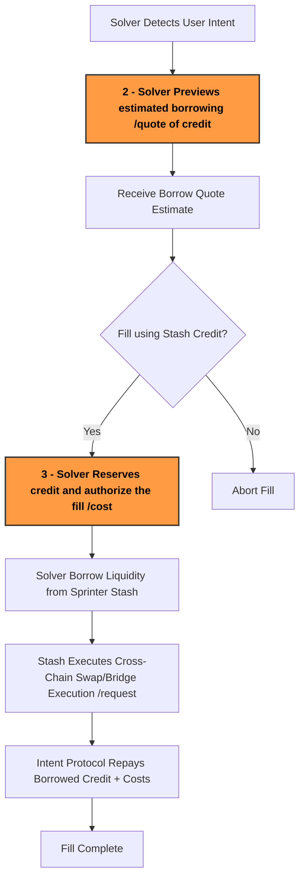

:::tip
Request your Stash API key via [Sprinter Stash Request](https://forms.gle/kgpcQK722Ley2gke7) or contacting support@sprinter.tech
:::

## For crosschain DeFi

Sprinter Stash enables solvers to **borrow crosschain credit on-demand** to execute user intents without needing pre-funded inventory.

## Overview of the Stash Fill Lifecycle

