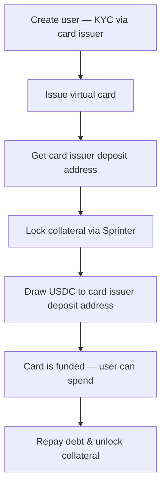

## Overview

A card issuer integration connects a card issuing platform (e.g. Rain, Stripe Issuing, Marqeta) with Sprinter Credit so that cardholders can spend against DeFi collateral instead of prefunded balances. The card issuer handles KYC, card issuance, and deposit contracts — Sprinter handles the credit line.

## Card Issuer Interface

The integration uses a generic `CardIssuer` interface that can be swapped for any card issuing platform:

```typescript
interface CardUser {
  id: string;
  applicationStatus: string; // "approved", "pending", "rejected"
}

interface CardContract {
  id: string;
  chainId: number;
  depositAddress: string; // on-chain address to receive USDC
}

interface Card {
  id: string;
  type: string;      // "virtual" or "physical"
  status: string;     // "active", "frozen", etc.
  last4: string;
  network: string;    // "visa", "mastercard"
}

interface CardIssuer {
  readonly isLive: boolean;

  /** Submit a KYC application for a wallet address */
  createUser(walletAddress: string): Promise<CardUser>;

  /** Get the on-chain deposit contract for a user on a given chain */
  retrieveContract(userId: string, chainId: number): Promise<CardContract>;

  /** Issue a virtual card for an approved user */
  issueCard(userId: string): Promise<Card>;
}
```

To integrate a real card issuer, implement this interface against their API. The Sprinter Credit side stays the same — only the card issuer implementation changes.

<div style={{ paddingRight: "120px" }}>

</div>

<Info>
This guide covers the full card issuer integration. If you only need the core credit draw mechanics (lock, draw, repay, unlock), see the [Credit Draw](/quickstart/credit-draw) quickstart.
</Info>

## Architecture

The integration has two sides:

| Component | Responsibility |
|---|---|
| **Card Issuer** | KYC/onboarding, card issuance, deposit contracts, card network settlement |
| **Sprinter Credit** | Collateral locking, credit line management, USDC draws, repayment |

Your backend orchestrates both — creating a user with the card issuer, then using Sprinter to fund the card via credit draws to the issuer's deposit address.

```
Your Backend
  ├── Card Issuer API
  │     ├── createUser(walletAddress)     → KYC approval
  │     ├── retrieveContract(userId)      → deposit address per chain
  │     └── issueCard(userId)             → virtual/physical card
  │
  └── Sprinter Credit API
        ├── /lock                         → lock collateral
        ├── /info                         → check credit line
        ├── /draw?receiver={depositAddr}  → fund card via deposit address
        ├── /repay                        → repay debt
        └── /unlock                       → recover collateral
```

## Integration Steps

<Steps>
  <Step title="Create User (KYC)">
    Submit the user's wallet address to the card issuer for KYC onboarding. The issuer handles identity verification and compliance.

    ```typescript
    const user = await cardIssuer.createUser(walletAddress);
    // user.id → use for all subsequent card issuer calls
    // user.applicationStatus → "approved" when KYC passes
    ```

    <Info>
    KYC approval may be instant or require manual review depending on the issuer. Poll the application status or register a webhook to be notified when the user is approved.
    </Info>
  </Step>

  <Step title="Retrieve Deposit Contract">
    Each card issuer provides a per-user deposit contract on the target chain. This is the address where USDC must be sent to fund the card.

    ```typescript
    const contract = await cardIssuer.retrieveContract(user.id, 8453); // Base
    // contract.depositAddress → pass as `receiver` in Sprinter draw calls
    ```

    The deposit address is chain-specific. For Base (chain ID 8453), the issuer returns a Base address where USDC deposits are auto-detected and credited to the card balance.
  </Step>

  <Step title="Issue Virtual Card">
    Once KYC is approved, issue a virtual card for the user.

    ```typescript
    const card = await cardIssuer.issueCard(user.id);
    // card.last4, card.network → display in your UI
    ```
  </Step>

  <Step title="Lock Collateral via Sprinter">
    Lock DeFi collateral to activate the user's credit line. This is the same `/lock` call from the [Credit Draw](/quickstart/credit-draw) quickstart.

    ```bash
    curl -X GET 'https://api.sprinter.tech/credit/accounts/0xUSER/lock?amount=1000000000&asset=0x833589fcd6edb6e08f4c7c32d4f71b54bda02913'
    ```

    Returns `{ calls: ContractCall[] }` — execute in the user's wallet.
  </Step>

  <Step title="Draw Credit to Card Issuer">
    Draw USDC from the credit line directly to the card issuer's deposit address. The issuer detects the on-chain deposit and credits the card balance.

    ```bash
    curl -X GET 'https://api.sprinter.tech/credit/accounts/0xUSER/draw?amount=50000000&receiver=0xDEPOSIT_ADDRESS'
    ```

    | Parameter | Description |
    |---|---|
    | `account` | User's wallet address (borrower) |
    | `amount` | USDC amount (6 decimals — $50 = `50000000`) |
    | `receiver` | Card issuer's deposit address from step 2 |

    Returns `{ calls: ContractCall[] }` — execute on-chain. The USDC goes directly to the issuer's deposit contract, funding the card.

    <Info>
    A **0.50% origination fee** is deducted from each draw. See [Fees](/sprinter-credit/credit-engine#fees).
    </Info>
  </Step>

  <Step title="Repay & Unlock">
    When the user wants to close out or at the end of a billing cycle, repay outstanding debt and unlock collateral.

    ```bash
    # Check outstanding debt
    curl -X GET https://api.sprinter.tech/credit/accounts/0xUSER/info

    # Repay
    curl -X GET 'https://api.sprinter.tech/credit/accounts/0xUSER/repay?amount=50000000'

    # Unlock collateral (after debt is cleared)
    curl -X GET 'https://api.sprinter.tech/credit/accounts/0xUSER/unlock?amount=1000000000&asset=0x833589fcd6edb6e08f4c7c32d4f71b54bda02913'
    ```

    Credit runs on a 30-day billing cycle with a 7-day grace period. See [Fees](/sprinter-credit/credit-engine#fees).
  </Step>
</Steps>

## Integration Notes

<AccordionGroup>
  <Accordion title="Deposit Address vs Settlement Address" icon="building-columns">
    The deposit address comes from the card issuer (per-user, per-chain). This is different from a settlement address used in authorization webhook flows. In this integration, USDC goes directly to the issuer's deposit contract — the issuer handles crediting the card.
  </Accordion>
  <Accordion title="Funding Model" icon="credit-card">
    This integration uses a **pre-funding** model: draw USDC to the card issuer before the user spends. For a **just-in-time** model where credit is drawn at swipe time via webhooks, see the [Authorization Webhook Handler](/quickstart/credit-draw/authorization-webhook).
  </Accordion>
  <Accordion title="KYC Timing" icon="clock">
    KYC approval can take seconds to days depending on the issuer. Design your UX to handle pending states — lock collateral after KYC is approved, not before.
  </Accordion>
  <Accordion title="Signer Security" icon="key">
    The signing key that executes draws must be secured with HSM or cloud KMS in production. See the [Credit Draw](/quickstart/credit-draw#delegated-credit-draws) guide for delegated draw patterns.
  </Accordion>
</AccordionGroup>

## Try It

The **Card Issuer Demo** runs the full integration lifecycle — KYC, card issuance, collateral locking, credit draw to deposit address, repay, and unlock — with a mock card issuer that can be swapped for a real implementation.

<Card title="Card Issuer Integration Demo" icon="play" href="https://github.com/sprintertech/sprinter-sdk/tree/main/docs/card-issuer-demo-mock">
  Clone the repo, add a wallet with USDC on Base, and run `npm run dev` to launch the demo on port 3003. Swap `MockCardIssuer` for a real card issuer implementation to validate against a live API.
</Card>

<Tip>
The mock card issuer auto-approves KYC and generates test card numbers. To connect to a real issuer, implement the `CardIssuer` interface in `card-issuer.ts` and swap it in `server.ts`.
</Tip>

## Related

<CardGroup cols={3}>
  <Card title="Credit Draw" icon="money-bill-transfer" href="/quickstart/credit-draw">
    Core credit draw lifecycle without card issuer integration.
  </Card>
  <Card title="Credit Engine" icon="gear" href="/sprinter-credit/credit-engine">
    Health factor, LTVs, and liquidation mechanics.
  </Card>
  <Card title="Credit API Reference" icon="bolt" href="/api-reference/sprinter/credit/get-credit-protocol-configuration">
    Full API reference with interactive playground.
  </Card>
</CardGroup>
