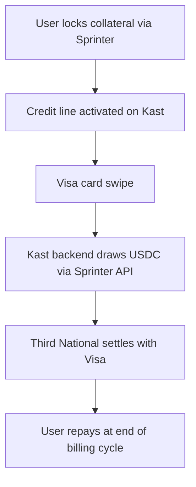

## Overview

[Kast](https://www.kast.xyz) is a stablecoin-powered Visa card platform where users post crypto collateral to unlock a spending limit. With Sprinter Credit, Kast can replace static collateral custody with a programmable credit line — collateral earns yield in DeFi while the card is active, and USDC is drawn just-in-time at each card swipe.

<div style={{ paddingRight: "120px" }}>

</div>

## Why Sprinter Credit for Kast

Kast's US card model already works on a collateral-backed credit basis — users post digital assets, get a spending limit, and repay monthly at 0% APR. Sprinter Credit enhances this by:

| Current (Kast native) | With Sprinter Credit |
|---|---|
| Collateral sits idle in custody (Fireblocks/BitGo) | Collateral earns yield in DeFi vaults (Gauntlet, YO) |
| Spending limit = full collateral value | Spending limit governed by configurable LTV ratios |
| Single-chain collateral | Cross-chain portfolio — ETH on Ethereum + USDC on Base = one credit line |
| Fixed liquidation rules | Programmable policy engine with per-user guardrails |

## Integration Steps

<Steps>
  <Step title="Lock Collateral & Activate Card">
    When a Kast user signs up and wants to activate their Visa card, prompt them to lock collateral via Sprinter instead of depositing into Kast's native custody.

    First, fetch available earn strategies so collateral earns yield while locked:

    ```bash
    curl -X GET https://api.sprinter.tech/credit/protocol
    ```

    Then lock collateral — the `earn` param auto-wraps into a yield-bearing vault:

    <Tabs>
      <Tab title="Lock + Earn Vault (Recommended)">
        ```bash
        curl -X GET 'https://api.sprinter.tech/credit/accounts/0xUSER/lock?amount=1000000000&asset=0xCOLLATERAL_TOKEN&earn=gauntlet-usdc-prime'
        ```
        Collateral earns yield in a Gauntlet or YO vault while the credit line is active. Use a strategy ID from `/credit/protocol`.
      </Tab>
      <Tab title="Lock (No Vault)">
        ```bash
        curl -X GET 'https://api.sprinter.tech/credit/accounts/0xUSER/lock?amount=1000000000&asset=0xCOLLATERAL_TOKEN'
        ```
        Lock the raw asset directly without vault wrapping.
      </Tab>
    </Tabs>

    Returns `{ calls: ContractCall[] }` — execute in the user's wallet. Once locked, Kast can activate the Visa card with a spending limit based on the credit capacity.
  </Step>

  <Step title="Set Spending Limit from Credit Capacity">
    Query the user's credit info to determine the Visa card spending limit:

    ```bash
    curl -X GET https://api.sprinter.tech/credit/accounts/0xUSER/info
    ```

    ```json
    {
      "data": {
        "USDC": {
          "totalCreditCapacity": "2000.00",
          "remainingCreditCapacity": "2000.00",
          "totalCollateralValue": "2500.00",
          "principal": "0",
          "interest": "0",
          "healthFactor": "Infinity",
          "dueDate": null
        }
      }
    }
    ```

    Map `remainingCreditCapacity` to the Kast card spending limit. Poll this periodically to update the limit as collateral values change.

    See [Credit Engine](/sprinter-credit/credit-engine) for how health factor, LTVs, and liquidation thresholds work.
  </Step>

  <Step title="Draw Credit on Card Swipe">
    When a cardholder swipes their Kast Visa, Third National sends an authorization request. Your backend draws USDC from Sprinter to fund the settlement:

    ```bash
    curl -X GET 'https://api.sprinter.tech/credit/accounts/0xUSER/draw?amount=50000000&receiver=0xKAST_SETTLEMENT'
    ```

    | Parameter | Description |
    |---|---|
    | `account` | User's wallet address (borrower) |
    | `amount` | USDC in lowest denomination (6 decimals — $50 = `50000000`) |
    | `receiver` | Kast's USDC settlement address for Third National/Visa settlement |

    Returns `{ calls: ContractCall[] }` — execute on-chain via a delegated signer to deliver USDC within the ~2 second authorization window.

    <Card title="Authorization Webhook Handler" icon="code" href="/quickstart/kast-card/authorization-webhook">
      Complete TypeScript implementation showing how to wire Sprinter `/draw` into Kast's Visa authorization flow with signature validation, credit checks, and sub-2-second execution.
    </Card>
  </Step>

  <Step title="Monthly Repayment">
    Kast's billing cycle runs ~30 days with a 21-day grace period. At cycle end, trigger repayment via Sprinter:

    <Tabs>
      <Tab title="Check Balance Owed">
        ```bash
        curl -X GET https://api.sprinter.tech/credit/accounts/0xUSER/info
        # Returns: principal, interest, dueDate
        ```
      </Tab>
      <Tab title="Build Repayment">
        ```bash
        curl -X GET 'https://api.sprinter.tech/credit/accounts/0xUSER/repay?amount=50000000'
        ```

        Returns `{ calls: ContractCall[] }`. Kast can run an automated repayment service — anyone can repay on behalf of any account.
      </Tab>
    </Tabs>
  </Step>

  <Step title="Unlock Collateral">
    When a user closes their Kast card or downgrades and has zero outstanding debt:

    ```bash
    curl -X GET 'https://api.sprinter.tech/credit/accounts/0xUSER/unlock?amount=1000000000&asset=0xCOLLATERAL_TOKEN'
    ```

    Returns `{ calls: ContractCall[] }`. Collateral (plus any earned yield) is returned to the user's wallet.
  </Step>
</Steps>

## Kast-Specific Considerations

<AccordionGroup>
  <Accordion title="Card Tiers & Credit Limits" icon="credit-card">
    Kast offers Standard (2% rewards), Premium (5%), and Luxe (8%) tiers. Map Sprinter Credit configurations to each tier — higher tiers could have higher LTV ratios or access to more collateral types via the [Policy Engine](/sprinter-credit/policy-engine).
  </Accordion>
  <Accordion title="Supported Stablecoins" icon="coins">
    Kast supports USDC, USDT, and USDe. Sprinter Credit currently uses USDC as the primary credit asset. Collateral can be deposited across Base, Ethereum, and Arbitrum — all chains Kast already supports for deposits.
  </Accordion>
  <Accordion title="Liquidation Alignment" icon="triangle-exclamation">
    Kast's native model liquidates collateral if payment is 21 days past due or collateral value drops below outstanding charges. Align Sprinter's health factor thresholds with these rules — a health factor < 1.0 triggers partial liquidation in Sprinter. See [Credit Engine](/sprinter-credit/credit-engine#position-health-ltvs-and-liquidations) for details.
  </Accordion>
  <Accordion title="Settlement via Third National" icon="building-columns">
    Kast uses Third National (Nimbus LLC) as the Visa card issuer. The `receiver` address in draw calls should point to the settlement address Third National expects for Visa network clearing.
  </Accordion>
  <Accordion title="Delegated Signing" icon="key">
    Card authorizations must complete without user interaction. Set up a server-side signer authorized to draw credit on behalf of users. See the [Authorization Webhook Handler](/quickstart/kast-card/authorization-webhook#delegated-signing) for options.
  </Accordion>
</AccordionGroup>

## API Flow Validation

The Sprinter Credit V2 API fully supports Kast's collateral-backed card model:

| Kast Card Flow | Sprinter API Endpoint | Status |
|---|---|---|
| User posts collateral | `GET /credit/accounts/{account}/lock` | Supported |
| Collateral earns yield | `GET /credit/accounts/{account}/lock?earn=STRATEGY_ID` | Supported |
| Check spending limit | `GET /credit/accounts/{account}/info` | Supported |
| Card swipe → fund settlement | `GET /credit/accounts/{account}/draw` | Supported |
| Monthly repayment | `GET /credit/accounts/{account}/repay` | Supported |
| Withdraw collateral | `GET /credit/accounts/{account}/unlock` | Supported |
| Monitor health factor | `GET /credit/accounts/{account}/info` → `healthFactor` | Supported |
| Get earn strategies | `GET /credit/protocol` → `strategies` | Supported |

## Related

<CardGroup cols={3}>
  <Card title="Credit Engine" icon="gear" href="/sprinter-credit/credit-engine">
    Health factor, LTVs, and liquidation mechanics.
  </Card>
  <Card title="Policy Engine" icon="sliders" href="/sprinter-credit/policy-engine">
    Configure credit operators and guardrails per card tier.
  </Card>
  <Card title="Credit API Reference" icon="bolt" href="/api-reference/sprinter/credit/get-credit-protocol-configuration">
    Full API reference with interactive playground.
  </Card>
</CardGroup>
