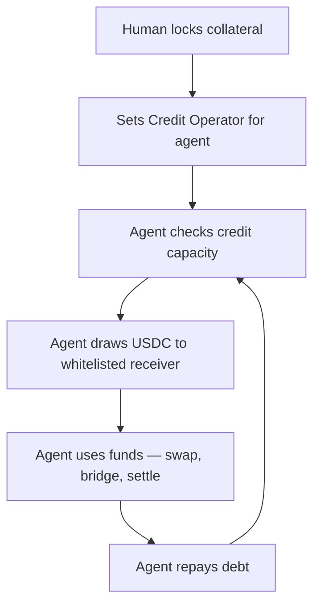

## Overview

AI agents need on-demand liquidity — to settle a swap, bridge funds, or execute a trade. But agents shouldn't need to manage collateral themselves. With Sprinter Credit, a human operator pledges collateral and delegates credit access to an agent. The agent draws and repays within the bounds the human defines.

This skill works with any agent framework. We provide:

- An **MCP server** for agents that speak [Model Context Protocol](https://modelcontextprotocol.io/) (LI.FI, Claude, Cursor, ChatGPT, etc.)
- A **direct API** pattern for agents using plain HTTP

<Card title="Example Repo" icon="github" href="https://github.com/sprintertech/documentation/tree/main/examples/sprinter-mcp">
  Full MCP server + demo agent script — clone and run.
</Card>

## How It Works

The credit lifecycle is split between two roles: the **human operator** who manages collateral, and the **agent** who uses the credit line.

```
Human operator (one-time setup):
  → Lock collateral (ETH, stETH, USDC, etc.)
  → Set up a Credit Operator authorizing the agent
  → Whitelist receiver addresses the agent can draw to

Agent (ongoing operations):
  → Check available credit capacity
  → Draw USDC to whitelisted receivers
  → Use the funds (swap, bridge, settle, trade)
  → Repay debt to restore capacity
```

The human retains full control of the collateral — the agent can only draw credit to pre-approved addresses and can never touch or withdraw the underlying collateral. See [Credit Operators](/sprinter-credit/policy-engine#credit-operators) for how the delegation model works.

<div style={{ paddingRight: "120px" }}>

</div>

## Before You Start

The human operator needs to set up the credit position and delegation before the agent can operate:

1. **Choose an account type** — EOA + Operator (simplest) or Smart Account (tightest guardrails). See [Credit Accounts](/sprinter-credit/credit-accounts).
2. **Set up a Credit Operator** — deploy or use an existing [Operator contract](/sprinter-credit/policy-engine#credit-operators) that authorizes the agent as a caller.
3. **Lock collateral** — the human locks assets to activate the credit line. See the [Credit Draw quickstart](/quickstart/credit-draw) for the lock flow.

Once this is done, the agent can operate autonomously within the delegated bounds.

## Human Operator Setup

<Steps>
  <Step title="Lock Collateral">
    The human locks collateral to activate the credit line. This is the collateral the agent's credit draws will be backed by.

    ```bash
    # Human locks 1 ETH as collateral
    curl -X GET 'https://api.sprinter.tech/credit/accounts/0xHUMAN_WALLET/lock?amount=1000000000000000000&asset=0xETH_ADDRESS'

    # Or lock with earn vault — collateral earns yield while locked
    curl -X GET 'https://api.sprinter.tech/credit/accounts/0xHUMAN_WALLET/lock?amount=1000000000000000000&asset=0xETH_ADDRESS&earn=STRATEGY_ID'
    ```

    Returns `{ calls: ContractCall[] }` — the human signs and submits.
  </Step>

  <Step title="Deploy Operator & Authorize Agent">
    Deploy an `ExclusiveOperator` with the agent's address as the authorized caller. Then the human opts in.

    ```solidity
    // 1. Deploy operator with agent as caller
    ExclusiveOperator operator = new ExclusiveOperator(agentAddress, creditHubAddress);

    // 2. Human sets the operator on their credit position
    creditHub.setOperator(address(operator));

    // 3. Human whitelists receiver addresses the agent can draw to
    creditHub.addCreditReceiver(dexRouterAddress);
    creditHub.addCreditReceiver(bridgeContractAddress);
    ```

    The agent can now draw credit — but only to whitelisted receivers. See [Credit Operators](/sprinter-credit/policy-engine#credit-operators) for custom operators with amount caps, time windows, and co-sign requirements.
  </Step>
</Steps>

## Agent Operations

Once the human has set up the credit position and delegation, the agent operates with these tools:

### MCP Integration

The Sprinter MCP server exposes 7 tools that any MCP-compatible agent can discover and call:

| Tool | Description | Used by |
|------|-------------|---------|
| `sprinter-health-check` | API health check | Agent |
| `sprinter-protocol-config` | Supported chains, collateral assets, LTV ratios | Agent |
| `sprinter-credit-info` | Account credit position — capacity, debt, health factor | Agent |
| `sprinter-lock-collateral` | Build calldata to lock collateral | Human (setup) |
| `sprinter-draw-credit` | Build calldata to borrow (draw) | Agent |
| `sprinter-repay-debt` | Build calldata to repay debt | Agent |
| `sprinter-unlock-collateral` | Build calldata to unlock collateral | Human |

#### Setup

Add to your MCP client config (Claude Desktop, Cursor, etc.):

```json
{
  "mcpServers": {
    "sprinter-credit": {
      "command": "npx",
      "args": ["tsx", "src/server.ts"],
      "cwd": "/path/to/examples/sprinter-mcp"
    }
  }
}
```

Or if you also use LI.FI's MCP server, the agent gets both tool sets:

```json
{
  "mcpServers": {
    "lifi": {
      "type": "http",
      "url": "https://mcp.li.quest/mcp"
    },
    "sprinter-credit": {
      "command": "npx",
      "args": ["tsx", "src/server.ts"],
      "cwd": "/path/to/examples/sprinter-mcp"
    }
  }
}
```

Now the agent can use LI.FI for routing/bridging and Sprinter for credit — borrowing liquidity just-in-time for a cross-chain swap.

### Direct API (No MCP)

If your agent doesn't use MCP, the same flow works with plain HTTP:

<Steps>
  <Step title="Check Credit Capacity">
    ```bash
    curl https://api.sprinter.tech/credit/accounts/0xHUMAN_WALLET/info
    ```

    Response includes `remainingCreditCapacity` — this is how much the agent can draw. The account is the human's address (the collateral owner).
  </Step>

  <Step title="Draw Credit">
    ```bash
    curl 'https://api.sprinter.tech/credit/accounts/0xHUMAN_WALLET/draw?amount=500000&receiver=0xWHITELISTED_RECEIVER'
    ```

    The agent draws USDC to a whitelisted receiver address via the Operator contract. The `receiver` can be a DEX router, bridge contract, or any address the human pre-approved.
  </Step>

  <Step title="Use the Funds">
    The agent does its work — swap via LI.FI, bridge to another chain, settle a trade, enter a yield position, etc.
  </Step>

  <Step title="Repay">
    ```bash
    curl 'https://api.sprinter.tech/credit/accounts/0xHUMAN_WALLET/repay?amount=500000'
    ```

    Repaying restores credit capacity. The agent can draw again immediately.
  </Step>
</Steps>

### Implementation

A minimal agent that draws from a delegated credit line, uses funds, and repays:

```typescript
const SPRINTER_API = "https://api.sprinter.tech";

interface ContractCall {
  to: string;
  data: string;
  value: string;
}

async function sprinterGet(path: string): Promise<any> {
  const res = await fetch(`${SPRINTER_API}${path}`);
  if (!res.ok) throw new Error(`Sprinter ${res.status}: ${await res.text()}`);
  return res.json();
}

async function executeCalls(calls: ContractCall[], signer: any): Promise<string> {
  let lastHash = "";
  for (const call of calls) {
    const tx = await signer.sendTransaction({
      to: call.to,
      data: call.data,
      value: call.value || "0",
    });
    const receipt = await tx.wait();
    if (!receipt || receipt.status !== 1) throw new Error(`Reverted: ${tx.hash}`);
    lastHash = tx.hash;
  }
  return lastHash;
}

/**
 * Agent draws from a human-delegated credit line, uses the funds, and repays.
 *
 * @param humanAccount - Human operator's wallet address (collateral owner)
 * @param agentSigner  - Agent's signer (authorized caller on the Operator)
 * @param borrowAmt    - Amount to borrow (USDC smallest unit)
 * @param receiver     - Whitelisted receiver address for the drawn USDC
 * @param useFunds     - Callback where the agent uses the borrowed funds
 */
async function agentBorrowAndRepay(
  humanAccount: string,
  agentSigner: any,
  borrowAmt: string,
  receiver: string,
  useFunds: () => Promise<void>
) {
  // 1. Check available credit
  const info = await sprinterGet(`/credit/accounts/${humanAccount}/info`);
  const available = parseFloat(info.data.USDC.remainingCreditCapacity);
  const needed = parseInt(borrowAmt) / 1e6;
  if (available < needed) {
    throw new Error(`Insufficient credit: ${available} USDC available, ${needed} needed`);
  }

  // 2. Draw credit (via Operator — agent is authorized caller)
  const drawData = await sprinterGet(
    `/credit/accounts/${humanAccount}/draw?amount=${borrowAmt}&receiver=${receiver}`
  );
  await executeCalls(drawData.calls, agentSigner);

  // 3. Agent uses the funds
  await useFunds();

  // 4. Repay
  const repayData = await sprinterGet(
    `/credit/accounts/${humanAccount}/repay?amount=${borrowAmt}`
  );
  await executeCalls(repayData.calls, agentSigner);
}
```

<Info>
The `useFunds` callback is where the agent plugs in its own logic — call LI.FI's API to bridge, execute a DEX swap, settle a trade, etc. The borrow/repay lifecycle wraps around whatever the agent needs to do.
</Info>

## When to Use This

| Scenario | How it works |
|----------|-------------|
| **Cross-chain swap** | Human delegates credit on Base. Agent borrows → bridges via LI.FI → repays when the swap settles. |
| **Just-in-time settlement** | Human backs a card program. Agent receives authorization → borrows to settle → repays when billing cycle ends. |
| **Arbitrage** | Human provides collateral. Agent spots a price difference → borrows → executes the arb → repays from profits. |
| **Yield farming** | Human delegates a credit line. Agent borrows to enter a short-term yield opportunity → repays when it unwinds. |
| **DCA / Recurring buys** | Human sets up an Operator with daily caps. Agent draws small amounts on schedule to accumulate a position. |

## Agent-Owned Credit (Advanced)

In some cases, an agent may manage its own collateral and credit line directly — without human delegation. This model is suited for fully autonomous agents that hold their own assets.

```
Agent owns collateral
  → Agent locks collateral (sprinter-lock-collateral)
  → Agent draws credit (sprinter-draw-credit)
  → Agent uses funds
  → Agent repays (sprinter-repay-debt)
  → Agent unlocks collateral (sprinter-unlock-collateral)
```

This follows the same API calls but the agent's wallet is both the collateral owner and the borrower. No Operator setup needed — the agent signs everything directly.

<Warning>
Agent-owned credit means the agent has full control over collateral. This model requires strong safeguards in the agent's logic to prevent collateral loss. For most use cases, human-delegated credit is safer — the agent can draw credit but never touch collateral.
</Warning>

## Related

<CardGroup cols={3}>
  <Card title="Health Monitor" icon="heart-pulse" href="/quickstart/agent-skills/health-monitor">
    Pair with the health monitor to auto-repay if the position gets risky.
  </Card>
  <Card title="Credit Operators" icon="key" href="/sprinter-credit/policy-engine#credit-operators">
    How operators work, existing operators, and how to build custom ones.
  </Card>
  <Card title="Credit Accounts" icon="wallet" href="/sprinter-credit/credit-accounts">
    EOA vs Smart Account — choosing the right account type for agent delegation.
  </Card>
</CardGroup>
