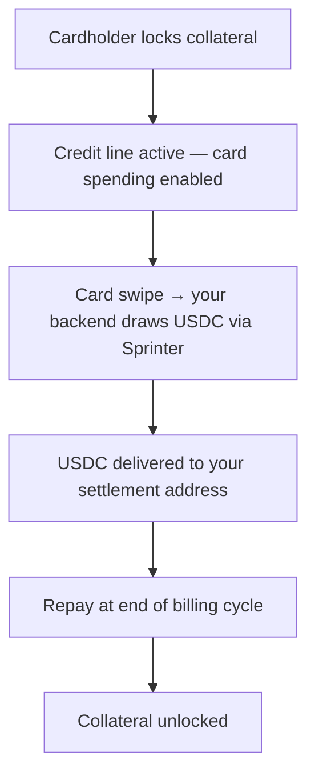

## Overview

If you run a card program (Rain, Stripe Issuing, Marqeta, etc.), Sprinter Credit lets your cardholders spend against locked DeFi collateral instead of prefunded balances. You keep your existing card stack — KYC, issuance, settlement — and plug in Sprinter as the credit engine.

Your integration is three API calls:

1. **Lock** — cardholder locks collateral, activating a credit line
2. **Draw** — your backend draws USDC to your settlement address when the card is used
3. **Repay** — debt is repaid at end of billing cycle, collateral unlocks

<div style={{ paddingRight: "120px" }}>

</div>

Every Sprinter endpoint returns `{ calls: ContractCall[] }` — unsigned transaction calldata. No custody handoff, no intermediaries.

## What You Need from Sprinter

| Your card program handles | Sprinter handles |
|---|---|
| KYC, compliance, card issuance | Collateral locking & credit line activation |
| Card network authorization & settlement | USDC credit draws to your settlement address |
| Cardholder UX, rewards, tiers | Health factor monitoring, LTV enforcement |
| Deposit addresses, funding detection | Earn vaults (collateral earns yield while locked) |
| Billing, statements | Repayment & collateral unlock |

## Before You Start

Card programs that draw credit on behalf of cardholders (e.g. just-in-time at card swipe) need a delegation model. You should decide upfront:

1. **Which account type?** EOA (existing wallet) or Smart Account — this affects onboarding and how delegation is set up. See [Credit Accounts](/sprinter-credit/credit-accounts).
2. **Which operator model?** A [Credit Operator](/sprinter-credit/policy-engine#credit-operators) lets your backend draw credit without cardholder interaction. Most card programs use the `ExclusiveOperator` — see [Delegated Credit Draws](#delegated-credit-draws) below for implementation.

## Integration

<Steps>
  <Step title="Cardholder Locks Collateral">
    When a cardholder wants to activate credit-backed spending, they lock collateral via your app. Optionally wrap into an earn vault so collateral earns yield while locked.

    ```bash
    # Lock USDC as collateral on Base
    curl -X GET 'https://api.sprinter.tech/credit/accounts/0xUSER/lock?amount=1000000000&asset=0x833589fcd6edb6e08f4c7c32d4f71b54bda02913'

    # Or lock + earn vault (collateral earns yield)
    curl -X GET 'https://api.sprinter.tech/credit/accounts/0xUSER/lock?amount=1000000000&asset=0x833589fcd6edb6e08f4c7c32d4f71b54bda02913&earn=STRATEGY_ID'
    ```

    Returns `{ calls: ContractCall[] }` — execute in the cardholder's wallet. Once locked, the credit line is active.

    Use `GET /credit/protocol` to fetch available collateral assets and earn strategies.
  </Step>

  <Step title="Set Card Spending Limit">
    Query the cardholder's credit position to determine the spending limit for your card program.

    ```bash
    curl -X GET https://api.sprinter.tech/credit/accounts/0xUSER/info
    ```

    ```json
    {
      "data": {
        "USDC": {
          "totalCreditCapacity": "900.00",
          "remainingCreditCapacity": "900.00",
          "totalCollateralValue": "1000.00",
          "principal": "0",
          "interest": "0",
          "healthFactor": "Infinity",
          "dueDate": null
        }
      }
    }
    ```

    Map `remainingCreditCapacity` to the card spending limit. Poll periodically to update as collateral values or debt change.
  </Step>

  <Step title="Draw USDC on Card Use">
    When the card is used, draw USDC from the cardholder's credit line to your settlement address. Two funding models:

    <Info>
    Just-in-time draws require a delegation model (Operator or Smart Account). If you haven't set this up yet, see [Before You Start](#before-you-start).
    </Info>

    <Tabs>
      <Tab title="Just-in-Time (at swipe)">
        Draw at the moment of each card authorization. Your backend receives the auth webhook, calls Sprinter `/draw`, executes on-chain, and responds — all within ~2 seconds.

        ```bash
        curl -X GET 'https://api.sprinter.tech/credit/accounts/0xUSER/draw?amount=50000000&receiver=0xYOUR_SETTLEMENT_ADDRESS'
        ```

        This requires a [delegated signer](#delegated-credit-draws) authorized to execute on behalf of the cardholder. See the [Authorization Webhook Handler](/quickstart/credit-draw/authorization-webhook) for a complete TypeScript implementation.
      </Tab>
      <Tab title="Pre-funding (batch)">
        Draw a lump sum to a per-user deposit address before the cardholder spends. Simpler to implement — no real-time on-chain execution needed.

        ```bash
        curl -X GET 'https://api.sprinter.tech/credit/accounts/0xUSER/draw?amount=500000000&receiver=0xDEPOSIT_ADDRESS'
        ```

        Your card program detects the USDC deposit and credits the card balance.
      </Tab>
    </Tabs>

    | Parameter | Description |
    |---|---|
    | `account` | Cardholder's wallet address |
    | `amount` | USDC amount (6 decimals — $50 = `50000000`) |
    | `receiver` | Your settlement or deposit address |

    Returns `{ calls: ContractCall[] }` — execute on-chain to deliver USDC.

    <Info>
    A **0.50% origination fee** is deducted from each draw. See [Fees](/sprinter-credit/credit-engine#fees).
    </Info>
  </Step>

  <Step title="Repay & Unlock">
    At end of billing cycle, repay the cardholder's outstanding debt. Once debt is cleared, collateral can be unlocked.

    ```bash
    # Check outstanding debt
    curl -X GET https://api.sprinter.tech/credit/accounts/0xUSER/info

    # Repay (anyone can repay on behalf of any account)
    curl -X GET 'https://api.sprinter.tech/credit/accounts/0xUSER/repay?amount=50000000'

    # Unlock collateral
    curl -X GET 'https://api.sprinter.tech/credit/accounts/0xUSER/unlock?amount=1000000000&asset=0x833589fcd6edb6e08f4c7c32d4f71b54bda02913'
    ```

    Credit runs on a 30-day billing cycle with a 7-day grace period. See [Fees](/sprinter-credit/credit-engine#fees).
  </Step>
</Steps>

## Delegated Credit Draws

Just-in-time card authorizations require drawing credit without cardholder interaction. This requires a [Credit Operator](/sprinter-credit/policy-engine#credit-operators) — a contract that lets your backend act on the user's credit position without custody. See [Credit Accounts](/sprinter-credit/credit-accounts) for choosing between EOA + Operator vs Smart Account. Two approaches:

<Tabs>
  <Tab title="Operator Contract (Recommended)">
    Deploy an [`ExclusiveOperator`](https://github.com/sprintertech/remote-collateral-contracts/blob/main/contracts/operator/ExclusiveOperator.sol) contract. Your backend address is the authorized caller. Cardholders opt in by setting the operator on their credit position.

    **Setup:**
    1. Deploy `ExclusiveOperator` with your backend as the `caller`
    2. Cardholder calls `setOperator()` on the Credit Hub
    3. Cardholder calls `addCreditReceiver()` to whitelist your settlement address

    **At swipe time:**
    ```solidity
    // Your backend calls directly — no cardholder signature needed
    operator.openCreditLine(borrower, settlementAddress, amount);
    ```

    **Safety:** The operator can only draw to whitelisted receivers — never touch collateral. Revocation has a time delay to prevent abuse during active billing cycles.
  </Tab>
  <Tab title="Smart Accounts (Non-Custodial)">
    Cardholders deploy a smart account (ERC-4337) and configure a session key or module that authorizes your backend to call `/draw`. The cardholder retains full custody.

    Most trust-minimized option — but requires cardholders to use smart accounts.
  </Tab>
</Tabs>

See the [Authorization Webhook Handler](/quickstart/credit-draw/authorization-webhook) for a complete implementation with signature validation, credit checks, and the full delegated draw flow.

## Integration Notes

<AccordionGroup>
  <Accordion title="From Credit to Action" icon="flag-checkered">
    The draw is the trigger — settlement is where value is delivered. When a card is swiped, Sprinter draws USDC to your settlement address, and your card network (Visa, Mastercard) clears the transaction. The cardholder bought coffee, paid for a flight, or shopped online — all funded by credit backed by their DeFi collateral. They never sold an asset, and the merchant received fiat through your normal settlement rails. See [From Credit to Action](/sprinter-credit/credit-engine#from-credit-to-action).
  </Accordion>
  <Accordion title="Settlement Address" icon="building-columns">
    The `receiver` in draw calls is your card program's settlement address — the on-chain address where USDC must land for card network clearing. For pre-funding, this can be a per-user deposit address instead.
  </Accordion>
  <Accordion title="Health Monitoring" icon="heart-pulse">
    Poll `healthFactor` from the info endpoint and adjust card spending limits accordingly. A health factor approaching 1.0 means the position is close to liquidation — reduce or freeze the card limit. See [Risk Management](/sprinter-credit/risk-management).
  </Accordion>
  <Accordion title="Collateral Yield" icon="chart-line">
    Use the `earn` parameter when locking to wrap collateral into a yield-bearing vault. This makes credit structurally cheaper — collateral earns while the card is active. Use `GET /credit/protocol` to discover available strategies.
  </Accordion>
  <Accordion title="Fail Closed" icon="shield">
    Always decline if the draw cannot be confirmed on-chain. A declined transaction is recoverable; an unauthorized spend is not.
  </Accordion>
  <Accordion title="Signer Security" icon="key">
    The signing key that executes JIT draws must be secured with HSM or cloud KMS (AWS KMS, GCP Cloud KMS) in production. Never store it in environment variables on shared infrastructure.
  </Accordion>
</AccordionGroup>

## Try It

The **Card Issuer Demo** runs the full credit-backed card lifecycle on Base — collateral locking, credit draw to a settlement address, repay, and unlock — with a mock card issuer that simulates the card program side.

<Card title="Card Program Demo" icon="play" href="https://github.com/sprintertech/documentation/tree/main/examples/card-issuer-demo-mock">
  Clone the repo, add a wallet with USDC and ETH on Base, and run `npm run dev`. The mock card issuer handles the card program side — focus on the Sprinter Credit steps.
</Card>

## API Reference

Every step maps to a single Sprinter endpoint:

| Card Program Flow | Sprinter API |
|---|---|
| Cardholder locks collateral | `GET /credit/accounts/{account}/lock` |
| Lock + earn vault | `GET /credit/accounts/{account}/lock?earn=STRATEGY_ID` |
| Check spending limit | `GET /credit/accounts/{account}/info` |
| Draw USDC to settlement | `GET /credit/accounts/{account}/draw?receiver={addr}` |
| Repay debt | `GET /credit/accounts/{account}/repay` |
| Unlock collateral | `GET /credit/accounts/{account}/unlock` |
| Get protocol config | `GET /credit/protocol` |

<CardGroup cols={3}>
  <Card title="Credit Draw" icon="money-bill-transfer" href="/quickstart/credit-draw">
    Core credit draw lifecycle — lock, draw, repay, unlock.
  </Card>
  <Card title="Credit Engine" icon="gear" href="/sprinter-credit/credit-engine">
    Health factor, LTVs, and liquidation mechanics.
  </Card>
  <Card title="Credit API Reference" icon="bolt" href="/api-reference/sprinter/credit/get-credit-protocol-configuration">
    Full API reference with interactive playground.
  </Card>
</CardGroup>
