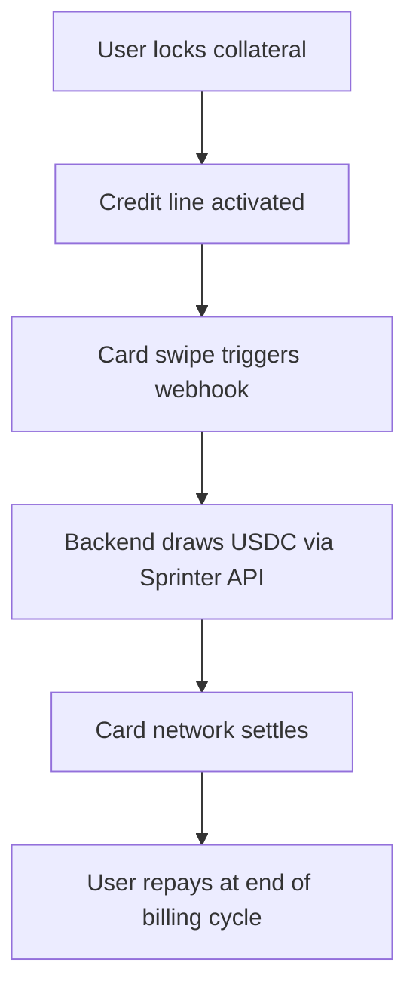

Card programs typically require users to deposit USDC upfront to fund their card. With Sprinter Credit, users lock DeFi collateral instead — and credit is drawn automatically at the moment of each card authorization.

<div style={{ display: "flex", justifyContent: "center" }}>

</div>

<Info>
This example uses [Rain](https://www.rain.xyz) as the card issuer, but the pattern applies to any card program with a webhook-based authorization flow.
</Info>

## Integration Steps

<Steps>
  <Step title="Lock Collateral">
    Instead of prompting users to top up with USDC, prompt them to lock collateral. A single `/lock` call handles everything — including optional wrapping into a yield-bearing earn vault.

    First, fetch available earn strategies from the protocol config:

    ```bash
    curl -X GET https://api.sprinter.tech/credit/protocol
    ```

    This returns the credit configuration including a `strategies` field with available earn vaults and their IDs.

    Then lock collateral — add the `earn` param to auto-wrap into a vault in the same transaction:

    <Tabs>
      <Tab title="Lock + Earn Vault">
        ```bash
        curl -X GET 'https://api.sprinter.tech/credit/accounts/0xUSER/lock?amount=1000000000000000000&asset=0xCOLLATERAL_TOKEN&earn=STRATEGY_ID'
        ```
        The `earn` parameter wraps the asset into a yield-bearing vault before locking — collateral earns while the credit line is active. Use a strategy ID from `/credit/protocol`.
      </Tab>
      <Tab title="Lock (No Vault)">
        ```bash
        curl -X GET 'https://api.sprinter.tech/credit/accounts/0xUSER/lock?amount=1000000000000000000&asset=0xCOLLATERAL_TOKEN'
        ```
        Omit `earn` to lock the raw asset directly without wrapping into a vault.
      </Tab>
    </Tabs>

    Returns `{ calls: ContractCall[] }` — execute in the user's wallet. Once locked, the credit line is active.
  </Step>

  <Step title="Check Available Credit">
    Display `totalCollateralValue` (spendable credit) and `healthFactor` in your card UI.

    ```bash
    curl -X GET https://api.sprinter.tech/credit/accounts/0xUSER/info
    ```

    ```json
    {
      "data": {
        "USDC": {
          "totalCollateralValue": "5000.00",
          "principal": "0",
          "interest": "0",
          "healthFactor": "Infinity",
          "dueDate": null
        }
      }
    }
    ```

    See [Credit Engine](/stash-credit-v2/credit-engine) for how health factor and LTVs work.
  </Step>

  <Step title="Draw Credit">
    With collateral locked, you can draw credit (USDC) from the user's credit line. In a card program, this happens in your authorization webhook handler — but the `/draw` endpoint itself is a general-purpose credit draw, not specific to card authorizations.

    ```bash
    curl -X GET 'https://api.sprinter.tech/credit/accounts/0xUSER/draw?amount=50000000&receiver=0xSETTLEMENT_ADDRESS'
    ```

    | Parameter | Description |
    |---|---|
    | `account` | User's wallet address (borrower) |
    | `amount` | USDC in lowest denomination (6 decimals — $50 = `50000000`) |
    | `receiver` | Address to receive the USDC (e.g. your card program's settlement address) |

    Returns `{ calls: ContractCall[] }` — execute on-chain to deliver USDC to the receiver.

    For card programs, you'll call `/draw` from your authorization webhook handler to fund each card swipe in real time:

    <Card title="Authorization Webhook Handler" icon="code" href="/quickstart/card-programs/authorization-webhook">
      Complete TypeScript implementation showing how to wire `/draw` into a card authorization flow with signature validation, credit checks, and sub-2-second execution.
    </Card>
  </Step>

  <Step title="Repayment">
    Credit runs on a monthly billing cycle. At month end, users repay principal + accrued interest.

    <Tabs>
      <Tab title="Check Balance Owed">
        ```bash
        curl -X GET https://api.sprinter.tech/credit/accounts/0xUSER/info
        # Returns: principal, interest, dueDate
        ```
      </Tab>
      <Tab title="Build Repayment">
        ```bash
        curl -X GET 'https://api.sprinter.tech/credit/accounts/0xUSER/repay?amount=50000000'
        ```

        Returns `{ calls: ContractCall[] }`. Anyone can repay on behalf of any account, so you can run an automated repayment service.
      </Tab>
    </Tabs>
  </Step>

  <Step title="Unlock Collateral">
    When a user closes their card and has zero outstanding debt:

    ```bash
    curl -X GET 'https://api.sprinter.tech/credit/accounts/0xUSER/unlock?amount=1000000000000000000&asset=0xCOLLATERAL_TOKEN'
    ```

    Returns `{ calls: ContractCall[] }`. Execute in the user's wallet to return collateral.
  </Step>
</Steps>

## Integration Notes

<AccordionGroup>
  <Accordion title="Delegated Signing" icon="key">
    For sub-second draws at spend time, set up a server-side signer authorized to draw on behalf of users. See [Authorization Webhook Handler](/quickstart/card-programs/authorization-webhook#delegated-signing) for options (ERC-7579 session keys, pre-signed permits, smart account delegation).
  </Accordion>
  <Accordion title="Settlement Address" icon="building-columns">
    Confirm with your card issuer which address to pass as `receiver` in the draw call. This is the address that receives USDC on each authorization.
  </Accordion>
  <Accordion title="Fail Closed" icon="shield">
    Always decline if the draw cannot be confirmed on-chain. A declined swipe is recoverable; an unauthorized spend is not.
  </Accordion>
  <Accordion title="Health Monitoring" icon="heart-pulse">
    Poll `healthFactor` from the info endpoint and surface alerts in your UI. See [Risk Management](/stash-credit-v2/risk-management) for liquidation thresholds and collateral tiers.
  </Accordion>
</AccordionGroup>

## Try It

Want to see the full card program lifecycle running end-to-end? The **Card Program Demo** executes every step above — lock, credit check, draw, repay, unlock — using real Sprinter API calls on Base.

It includes a web dashboard with live progress and a CLI mode, and supports dry-run for testing without on-chain transactions.

<Card title="Card Program Demo" icon="play" href="https://github.com/sprintertech/documentation/tree/main/demo">
  Clone the repo, add a wallet with USDC on Base, and run `npm run ui` to launch the demo dashboard. See the README for full setup instructions.
</Card>

## Related

<CardGroup cols={3}>
  <Card title="Credit Engine" icon="gear" href="/stash-credit-v2/credit-engine">
    Health factor, LTVs, and liquidation mechanics.
  </Card>
  <Card title="Risk Management" icon="shield-halved" href="/stash-credit-v2/risk-management">
    Collateral tiers and concentration limits.
  </Card>
  <Card title="Credit API Reference" icon="bolt" href="/api-reference/sprinter/credit/get-credit-protocol-configuration">
    Full API reference with interactive playground.
  </Card>
</CardGroup>
