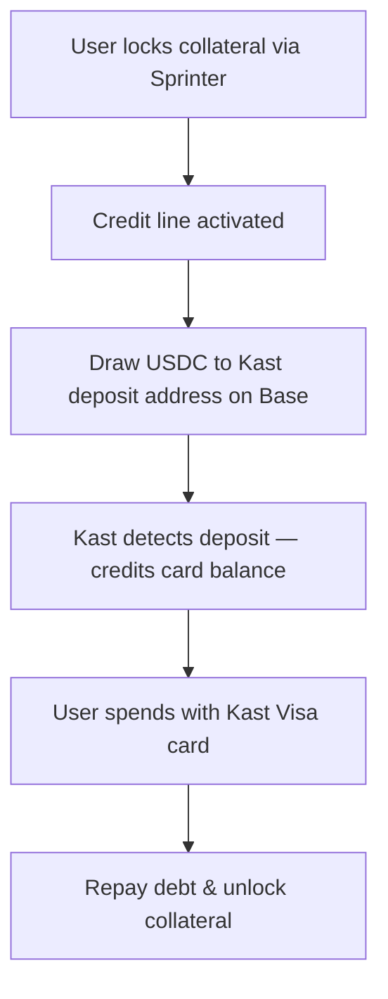

## Overview

[Kast](https://kast.xyz) is a stablecoin-powered neobank offering Visa debit cards funded by USDC, USDT, and USDe. Today, users deposit stablecoins → Kast credits the card → users spend anywhere Visa is accepted.

With Sprinter Credit, Kast cardholders don't need to sell or transfer their crypto to fund their card. Instead, they **lock DeFi collateral and draw USDC credit directly to their Kast deposit address** — keeping their assets earning yield while spending against them.

### Why This Matters for Kast

| Without Sprinter | With Sprinter |
|---|---|
| User sells/transfers crypto → deposits USDC to Kast → spends | User locks crypto → borrows USDC → Kast card funded instantly |
| Deposited assets sit idle on the card | Collateral earns yield in DeFi vaults while the card is active |
| User must manually top up card balance | Credit line auto-funds based on collateral value |
| Single-chain deposits only | Cross-chain collateral — ETH on Ethereum + USDC on Base = one credit line |

<div style={{ paddingRight: "120px" }}>

</div>

<Info>
This guide covers the full Kast-specific integration. For a generic card issuer pattern that works with any platform, see the [Card Issuer Integration](/quickstart/card-issuer-integration) quickstart.
</Info>

## Architecture

Kast is built on [Rain.xyz](https://rain.xyz) card issuing infrastructure — a Visa Principal Member handling on-chain USDC settlement. The integration connects Sprinter's credit engine to Kast's existing deposit flow with zero changes to Kast's card network or settlement layer.

```
Kast Backend
  ├── Kast / Rain Infrastructure
  │     ├── KYC onboarding (Sumsub)
  │     ├── Per-user deposit address on Base
  │     ├── Virtual / physical Visa card issuance
  │     ├── Apple Pay / Google Pay
  │     └── Visa network settlement (via Third National)
  │
  └── Sprinter Credit API
        ├── /lock           → lock collateral (USDC, wETH, etc.)
        ├── /info           → credit capacity, health factor
        ├── /draw           → draw USDC to Kast deposit address
        ├── /repay          → repay outstanding debt
        └── /unlock         → recover collateral
```

| Component | Responsibility |
|---|---|
| **Kast** | KYC (Sumsub), card issuance, cardholder UX, cashback rewards |
| **Rain.xyz** | Card infrastructure, BIN sponsorship (Third National), on-chain deposit detection |
| **Sprinter Credit** | Collateral locking, credit line management, USDC draws, earn vaults, repayment |

## Integration Steps

<Steps>
  <Step title="User Onboarding (KYC via Kast)">
    Kast handles KYC through Sumsub. Level 2 verification (government ID + liveness check) is required before card issuance.

    ```typescript
    // Kast handles KYC in their app — the user completes onboarding natively.
    // Once approved, Kast returns a user ID for subsequent API calls.

    const user = await kast.createUser(walletAddress);
    // user.id → use for all subsequent calls
    // user.applicationStatus → "approved" when Level 2 KYC passes
    ```

    <Info>
    KYC is handled entirely within the Kast app. If building a co-branded experience, coordinate with Kast on the onboarding flow.
    </Info>
  </Step>

  <Step title="Get Kast Deposit Address on Base">
    Each Kast user gets a per-user deposit address on supported chains. For Base (chain ID 8453), USDC deposits are auto-detected and credited to the card balance at 1:1 with 0% spread.

    ```typescript
    const depositInfo = await kast.getDepositAddress(userId, 8453); // Base
    // depositInfo.address → 0x... (per-user deposit address on Base)
    // This address is the `receiver` for Sprinter draw calls
    ```

    Kast supports deposits on Ethereum, Solana, Polygon, Arbitrum, and Base (via Rain infrastructure). Sprinter Credit operates on Base, so use the Base deposit address.
  </Step>

  <Step title="Issue Kast Card">
    Virtual cards are issued instantly (under 2 minutes) and work with Apple Pay and Google Pay. Physical cards ship in 7–10 days.

    ```typescript
    const card = await kast.issueCard(userId, "virtual");
    // card.last4 → "4242"
    // card.network → "visa"
    // card.tier → "K Card" | "X Card" | "Founders" | "Luxe"
    ```

    | Tier | Cashback | Cost |
    |------|----------|------|
    | K Card | 1–4% | Free |
    | X Card | 4–8% | $1,000/year |
    | Founders | 4–8% | $5,000 one-time |
    | Luxe | 6% | $10,000/year |
  </Step>

  <Step title="Lock Collateral via Sprinter">
    Lock DeFi collateral on Base to activate the user's credit line. Optionally wrap into a yield-bearing earn vault so collateral earns while the card is active.

    <Tabs>
      <Tab title="Lock + Earn Vault">
        ```bash
        curl -X GET 'https://api.sprinter.tech/credit/accounts/0xUSER/lock?amount=1000000000&asset=0x833589fcd6edb6e08f4c7c32d4f71b54bda02913&earn=STRATEGY_ID'
        ```
        Collateral earns yield in the vault while the credit line is active. Use a strategy ID from `GET /credit/protocol`.
      </Tab>
      <Tab title="Lock (No Vault)">
        ```bash
        curl -X GET 'https://api.sprinter.tech/credit/accounts/0xUSER/lock?amount=1000000000&asset=0x833589fcd6edb6e08f4c7c32d4f71b54bda02913'
        ```
      </Tab>
    </Tabs>

    Returns `{ calls: ContractCall[] }` — execute in the user's wallet. Once locked, the credit line is active and the Kast card can be funded.
  </Step>

  <Step title="Check Credit Capacity">
    Query the credit line to determine how much the user can draw. Display `remainingCreditCapacity` as the available card funding amount in your UI.

    ```bash
    curl -X GET https://api.sprinter.tech/credit/accounts/0xUSER/info
    ```

    ```json
    {
      "data": {
        "USDC": {
          "totalCreditCapacity": "900.00",
          "remainingCreditCapacity": "900.00",
          "totalCollateralValue": "1000.00",
          "principal": "0",
          "interest": "0",
          "healthFactor": "Infinity",
          "dueDate": null
        }
      }
    }
    ```

    See [Credit Engine](/sprinter-credit/credit-engine) for how health factor and LTVs work.
  </Step>

  <Step title="Draw USDC to Kast Deposit Address">
    Draw USDC from the credit line directly to the user's Kast deposit address on Base. Kast auto-detects the on-chain deposit and credits the card balance.

    ```bash
    curl -X GET 'https://api.sprinter.tech/credit/accounts/0xUSER/draw?amount=50000000&receiver=0xKAST_DEPOSIT_ADDRESS'
    ```

    | Parameter | Description |
    |---|---|
    | `account` | User's wallet address (borrower) |
    | `amount` | USDC amount (6 decimals — $50 = `50000000`) |
    | `receiver` | User's Kast deposit address on Base (from step 2) |

    Returns `{ calls: ContractCall[] }` — execute on-chain. USDC goes directly to the Kast deposit address. Kast detects the deposit and credits the card balance, typically within 1–5 minutes.

    <Info>
    A **0.50% origination fee** is deducted from each draw. See [Fees](/sprinter-credit/credit-engine#fees).
    </Info>
  </Step>

  <Step title="User Spends with Kast Card">
    Once the card is funded, the user spends anywhere Visa is accepted — in-store, online, or via Apple Pay / Google Pay. Kast handles authorization and Visa settlement via Rain/Third National.

    No Sprinter interaction needed at spend time — the card is pre-funded with USDC from the credit draw.
  </Step>

  <Step title="Repay & Unlock">
    At the end of a billing cycle or when the user wants to recover collateral:

    ```bash
    # Check outstanding debt
    curl -X GET https://api.sprinter.tech/credit/accounts/0xUSER/info

    # Repay
    curl -X GET 'https://api.sprinter.tech/credit/accounts/0xUSER/repay?amount=50000000'

    # Unlock collateral (after debt is cleared)
    curl -X GET 'https://api.sprinter.tech/credit/accounts/0xUSER/unlock?amount=1000000000&asset=0x833589fcd6edb6e08f4c7c32d4f71b54bda02913'
    ```

    Credit runs on a 30-day billing cycle with a 7-day grace period. See [Fees](/sprinter-credit/credit-engine#fees).
  </Step>
</Steps>

## Just-in-Time Authorization (Advanced)

The integration above uses a **pre-funding** model — draw USDC to the Kast deposit address before the user spends. For a **just-in-time** model where credit is drawn at the moment of each card swipe:

<Card title="Authorization Webhook Handler" icon="code" href="/quickstart/kast-card/authorization-webhook">
  TypeScript implementation showing how to wire Sprinter `/draw` into Kast's Visa authorization flow — signature validation, credit checks, on-chain execution, all within the ~2 second Visa authorization window.
</Card>

## End-to-End Example

A complete TypeScript integration wiring Sprinter Credit to Kast's deposit flow:

```typescript
import { ethers } from "ethers";

const SPRINTER_API = "https://api.sprinter.tech";
const USDC = "0x833589fcd6edb6e08f4c7c32d4f71b54bda02913";

interface ContractCall {
  to: string;
  data: string;
  value: string;
}

async function sprinterGet(path: string): Promise<any> {
  const res = await fetch(`${SPRINTER_API}${path}`);
  if (!res.ok) throw new Error(`Sprinter ${res.status}: ${await res.text()}`);
  return res.json();
}

async function executeCalls(
  calls: ContractCall[],
  signer: ethers.Wallet
): Promise<string> {
  let lastHash = "";
  for (const call of calls) {
    const tx = await signer.sendTransaction({
      to: call.to,
      data: call.data,
      value: call.value || "0",
    });
    const receipt = await tx.wait();
    if (!receipt || receipt.status !== 1) throw new Error(`Reverted: ${tx.hash}`);
    lastHash = tx.hash;
  }
  return lastHash;
}

/**
 * Fund a Kast card via Sprinter Credit.
 *
 * @param account          - User's wallet address
 * @param signer           - Ethers signer for the wallet
 * @param kastDepositAddr  - User's Kast deposit address on Base
 * @param collateralAmount - Collateral to lock (USDC smallest unit)
 * @param drawAmount       - Amount to draw to Kast (USDC smallest unit)
 */
async function fundKastCard(
  account: string,
  signer: ethers.Wallet,
  kastDepositAddr: string,
  collateralAmount: string,
  drawAmount: string
) {
  // 1. Lock collateral
  const lockData = await sprinterGet(
    `/credit/accounts/${account}/lock?amount=${collateralAmount}&asset=${USDC}`
  );
  await executeCalls(lockData.calls, signer);
  console.log("Collateral locked");

  // 2. Check credit capacity
  const info = await sprinterGet(`/credit/accounts/${account}/info`);
  const remaining = parseFloat(info.data.USDC.remainingCreditCapacity);
  console.log(`Credit capacity: ${remaining} USDC`);

  // 3. Draw USDC to Kast deposit address
  const drawData = await sprinterGet(
    `/credit/accounts/${account}/draw?amount=${drawAmount}&receiver=${kastDepositAddr}`
  );
  await executeCalls(drawData.calls, signer);
  console.log(`Drew ${drawAmount} USDC to Kast deposit: ${kastDepositAddr}`);
  // Kast auto-detects the deposit and credits the card balance
}
```

## Integration Notes

<AccordionGroup>
  <Accordion title="Deposit Detection" icon="magnifying-glass">
    Kast (via Rain) monitors deposit addresses for incoming USDC transfers. Once the Sprinter draw transaction confirms on Base, Kast detects the deposit and credits the card balance — typically within 1–5 minutes depending on chain finality.
  </Accordion>
  <Accordion title="Supported Chains" icon="link">
    Kast supports deposits on Ethereum, Solana, Polygon, Arbitrum, and Base. Sprinter Credit operates on Base — use the user's Base deposit address from Kast as the `receiver` in draw calls.
  </Accordion>
  <Accordion title="Collateral Yield" icon="chart-line">
    Use the `earn` parameter when locking collateral to wrap it into a yield-bearing vault. The user's collateral earns while their Kast card is active — spending capital stays productive. Combined with Kast's 1–8% cashback, users earn on both sides.
  </Accordion>
  <Accordion title="Stablecoin Support" icon="coins">
    Kast supports USDC, USDT, and USDe for deposits. Sprinter Credit uses USDC as the primary credit asset. Collateral can be any supported asset (USDC, wETH, etc.) — the draw always delivers USDC to the Kast deposit address.
  </Accordion>
  <Accordion title="Signer Security" icon="key">
    If automating draws on behalf of users, the signing key must be secured with HSM or cloud KMS (AWS KMS, GCP Cloud KMS) in production. See [Delegated Credit Draws](/quickstart/credit-draw#delegated-credit-draws) for server-side draw patterns.
  </Accordion>
</AccordionGroup>

## API Compatibility

Every step in Kast's card funding flow maps directly to a Sprinter Credit API endpoint:

| Kast Card Flow | Sprinter API | Status |
|---|---|---|
| User posts collateral | `GET /credit/accounts/{account}/lock` | Supported |
| Collateral earns yield | `GET /credit/accounts/{account}/lock?earn=STRATEGY_ID` | Supported |
| Check card funding limit | `GET /credit/accounts/{account}/info` | Supported |
| Fund card via deposit | `GET /credit/accounts/{account}/draw?receiver={kastDeposit}` | Supported |
| Monthly repayment | `GET /credit/accounts/{account}/repay` | Supported |
| Withdraw collateral | `GET /credit/accounts/{account}/unlock` | Supported |
| Monitor health factor | `GET /credit/accounts/{account}/info` → `healthFactor` | Supported |
| Get earn strategies | `GET /credit/protocol` → `strategies` | Supported |

## Related

<CardGroup cols={3}>
  <Card title="Card Issuer Integration" icon="credit-card" href="/quickstart/card-issuer-integration">
    Generic card issuer integration pattern — works with any platform.
  </Card>
  <Card title="Credit Engine" icon="gear" href="/sprinter-credit/credit-engine">
    Health factor, LTVs, and liquidation mechanics.
  </Card>
  <Card title="Credit API Reference" icon="bolt" href="/api-reference/sprinter/credit/get-credit-protocol-configuration">
    Full API reference with interactive playground.
  </Card>
</CardGroup>
