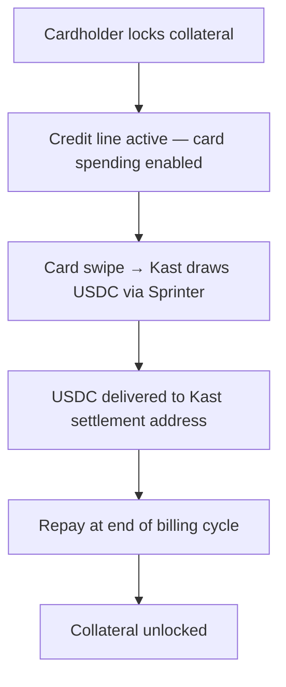

## Overview

[Kast](https://kast.xyz) is a stablecoin-powered neobank with Visa debit cards. Today, users deposit stablecoins to fund their card. With Sprinter Credit, Kast can offer **credit-backed spending** — cardholders lock collateral (which earns yield), and Kast draws USDC from Sprinter to settle card transactions.

Kast keeps its existing stack — KYC, card issuance, settlement via Rain/Third National. Sprinter plugs in as the credit engine.

| Without Sprinter | With Sprinter |
|---|---|
| User deposits USDC → card funded → user spends | User locks collateral → Kast draws credit on card use |
| Deposited assets sit idle | Collateral earns yield in DeFi vaults |
| User manually tops up balance | Credit line funds the card automatically |
| Single-chain deposits | Cross-chain collateral — one credit line |

<div style={{ paddingRight: "120px" }}>

</div>

## What Kast Keeps vs What Sprinter Adds

| Kast handles (no changes) | Sprinter provides |
|---|---|
| KYC via Sumsub | Collateral locking & credit line activation |
| Card issuance (virtual + physical) | USDC credit draws to Kast's settlement address |
| Apple Pay / Google Pay | Health factor monitoring, LTV enforcement |
| Visa settlement via Rain / Third National | Earn vaults — collateral earns while locked |
| Cashback rewards (1–8% by tier) | Repayment & collateral unlock |

## Before You Start

Card programs that draw credit on behalf of cardholders (e.g. just-in-time at card swipe) need a delegation model. You should decide upfront:

1. **Which account type?** EOA (existing wallet) or Smart Account — this affects onboarding and how delegation is set up. See [Credit Accounts](/sprinter-credit/credit-accounts).
2. **Which operator model?** A [Credit Operator](/sprinter-credit/policy-engine#credit-operators) lets your backend draw credit without cardholder interaction. Most card programs use the `ExclusiveOperator` — see [Delegated Credit Draws](#delegated-credit-draws) below for implementation.

## Integration

<Steps>
  <Step title="Cardholder Locks Collateral">
    After Kast's normal onboarding, the cardholder locks collateral to activate credit-backed spending. Optionally wrap into an earn vault so collateral earns yield while locked.

    ```bash
    # Lock USDC as collateral on Base
    curl -X GET 'https://api.sprinter.tech/credit/accounts/0xUSER/lock?amount=1000000000&asset=0x833589fcd6edb6e08f4c7c32d4f71b54bda02913'

    # Or lock + earn vault (collateral earns yield)
    curl -X GET 'https://api.sprinter.tech/credit/accounts/0xUSER/lock?amount=1000000000&asset=0x833589fcd6edb6e08f4c7c32d4f71b54bda02913&earn=STRATEGY_ID'
    ```

    Returns `{ calls: ContractCall[] }` — execute in the cardholder's wallet. Once locked, the credit line is active.

    Use `GET /credit/protocol` to fetch available collateral assets and earn strategies.
  </Step>

  <Step title="Set Card Spending Limit">
    Query the cardholder's credit position. Map `remainingCreditCapacity` to the Kast card spending limit.

    ```bash
    curl -X GET https://api.sprinter.tech/credit/accounts/0xUSER/info
    ```

    ```json
    {
      "data": {
        "USDC": {
          "totalCreditCapacity": "900.00",
          "remainingCreditCapacity": "900.00",
          "totalCollateralValue": "1000.00",
          "principal": "0",
          "interest": "0",
          "healthFactor": "Infinity",
          "dueDate": null
        }
      }
    }
    ```

    Poll periodically to update the limit as collateral values or debt change.
  </Step>

  <Step title="Draw USDC on Card Use">
    When the card is used, Kast draws USDC from the cardholder's credit line to its settlement address. Two funding models:

    <Info>
    Just-in-time draws require a delegation model (Operator or Smart Account). If you haven't set this up yet, see [Before You Start](#before-you-start).
    </Info>

    <Tabs>
      <Tab title="Just-in-Time (at swipe)">
        Draw at the moment of each Visa authorization. Kast's backend receives the auth from Rain/Third National, calls Sprinter `/draw`, executes on-chain, and responds — all within ~2 seconds.

        ```bash
        curl -X GET 'https://api.sprinter.tech/credit/accounts/0xUSER/draw?amount=50000000&receiver=0xKAST_SETTLEMENT_ADDRESS'
        ```

        This requires a [delegated signer](#delegated-credit-draws) authorized to execute on behalf of the cardholder. See the [Authorization Webhook Handler](/quickstart/kast-card/authorization-webhook) for a complete implementation.
      </Tab>
      <Tab title="Pre-funding (deposit)">
        Draw a lump sum to the cardholder's Kast deposit address before they spend. Simpler — no real-time on-chain execution needed.

        ```bash
        curl -X GET 'https://api.sprinter.tech/credit/accounts/0xUSER/draw?amount=500000000&receiver=0xKAST_DEPOSIT_ADDRESS'
        ```

        Kast auto-detects the USDC deposit and credits the card balance (typically 1–5 minutes).
      </Tab>
    </Tabs>

    | Parameter | Description |
    |---|---|
    | `account` | Cardholder's wallet address |
    | `amount` | USDC amount (6 decimals — $50 = `50000000`) |
    | `receiver` | Kast's settlement address or per-user deposit address |

    Returns `{ calls: ContractCall[] }` — execute on-chain to deliver USDC.

    <Info>
    A **0.50% origination fee** is deducted from each draw. See [Fees](/sprinter-credit/credit-engine#fees).
    </Info>
  </Step>

  <Step title="Repay & Unlock">
    At end of billing cycle, repay the cardholder's outstanding debt. Once cleared, collateral can be unlocked.

    ```bash
    # Check outstanding debt
    curl -X GET https://api.sprinter.tech/credit/accounts/0xUSER/info

    # Repay (anyone can repay on behalf of any account)
    curl -X GET 'https://api.sprinter.tech/credit/accounts/0xUSER/repay?amount=50000000'

    # Unlock collateral
    curl -X GET 'https://api.sprinter.tech/credit/accounts/0xUSER/unlock?amount=1000000000&asset=0x833589fcd6edb6e08f4c7c32d4f71b54bda02913'
    ```

    Credit runs on a 30-day billing cycle with a 7-day grace period. See [Fees](/sprinter-credit/credit-engine#fees).
  </Step>
</Steps>

## Delegated Credit Draws

Just-in-time card authorizations require drawing credit without cardholder interaction. This requires a [Credit Operator](/sprinter-credit/policy-engine#credit-operators) — a contract that lets your backend act on the user's credit position without custody. See [Credit Accounts](/sprinter-credit/credit-accounts) for choosing between EOA + Operator vs Smart Account. Two approaches:

<Tabs>
  <Tab title="Operator Contract (Recommended)">
    Kast deploys an [`ExclusiveOperator`](https://github.com/sprintertech/remote-collateral-contracts/blob/main/contracts/operator/ExclusiveOperator.sol) contract. Kast's backend address is the authorized caller. Cardholders opt in by setting the operator on their credit position.

    **Setup:**
    1. Deploy `ExclusiveOperator` with Kast's backend as the `caller`
    2. Cardholder calls `setOperator()` on the Credit Hub
    3. Cardholder calls `addCreditReceiver()` to whitelist Kast's settlement address

    **At swipe time:**
    ```solidity
    // Kast backend calls directly — no cardholder signature needed
    operator.openCreditLine(borrower, kastSettlementAddress, amount);
    ```

    **Safety:** The operator can only draw to whitelisted receivers — never touch collateral. Revocation has a time delay to prevent abuse during active billing cycles.
  </Tab>
  <Tab title="Smart Accounts (Non-Custodial)">
    Cardholders deploy a smart account (ERC-4337) and configure a session key authorizing Kast's backend to call `/draw`. Cardholder retains full custody.

    Most trust-minimized option — but requires cardholders to use smart accounts.
  </Tab>
</Tabs>

<Card title="Authorization Webhook Handler" icon="code" href="/quickstart/kast-card/authorization-webhook">
  Complete TypeScript implementation showing how to wire Sprinter `/draw` into Kast's Visa authorization flow — signature validation, credit checks, on-chain execution, all within the ~2 second window.
</Card>

## Integration Notes

<AccordionGroup>
  <Accordion title="Supported Chains" icon="link">
    Kast supports deposits on Ethereum, Solana, Polygon, Arbitrum, and Base (via Rain). Sprinter Credit operates on Base — use Base for settlement or deposit addresses.
  </Accordion>
  <Accordion title="Collateral Yield + Cashback" icon="chart-line">
    Cardholders earn on both sides — vault yield on locked collateral (via Sprinter earn strategies) and 1–8% cashback on spend (via Kast card tiers). This makes credit-backed spending strictly better than prefunded deposits.
  </Accordion>
  <Accordion title="Health Monitoring" icon="heart-pulse">
    Poll `healthFactor` from the info endpoint and adjust card spending limits accordingly. A health factor approaching 1.0 means the position is close to liquidation — reduce or freeze the card limit. See [Risk Management](/sprinter-credit/risk-management).
  </Accordion>
  <Accordion title="Fail Closed" icon="shield">
    Always decline if the draw cannot be confirmed on-chain. A declined transaction is recoverable; an unauthorized spend is not.
  </Accordion>
  <Accordion title="Signer Security" icon="key">
    The signing key that executes JIT draws must be secured with HSM or cloud KMS (AWS KMS, GCP Cloud KMS). Never store it in environment variables on shared infrastructure.
  </Accordion>
</AccordionGroup>

## API Reference

Every step maps to a single Sprinter endpoint:

| Kast Card Flow | Sprinter API |
|---|---|
| Cardholder locks collateral | `GET /credit/accounts/{account}/lock` |
| Lock + earn vault | `GET /credit/accounts/{account}/lock?earn=STRATEGY_ID` |
| Check spending limit | `GET /credit/accounts/{account}/info` |
| Draw USDC to settlement | `GET /credit/accounts/{account}/draw?receiver={addr}` |
| Repay debt | `GET /credit/accounts/{account}/repay` |
| Unlock collateral | `GET /credit/accounts/{account}/unlock` |
| Get protocol config | `GET /credit/protocol` |

## Try It

The **Card Program Demo** runs the full credit-backed card lifecycle on Base — collateral locking, credit draw to a settlement address, repay, and unlock — with a mock card issuer that simulates the card program side.

<Card title="Card Program Demo" icon="play" href="https://github.com/sprintertech/documentation/tree/main/examples/card-issuer-demo-mock">
  Clone the repo, add a wallet with USDC and ETH on Base, and run `npm run dev`. The mock card issuer handles the card program side — focus on the Sprinter Credit steps.
</Card>

## Related

<CardGroup cols={3}>
  <Card title="Card Program" icon="credit-card" href="/quickstart/card-program">
    Generic card program integration — works with any issuer.
  </Card>
  <Card title="Credit Engine" icon="gear" href="/sprinter-credit/credit-engine">
    Health factor, LTVs, and liquidation mechanics.
  </Card>
  <Card title="Credit API Reference" icon="bolt" href="/api-reference/sprinter/credit/get-credit-protocol-configuration">
    Full API reference with interactive playground.
  </Card>
</CardGroup>
