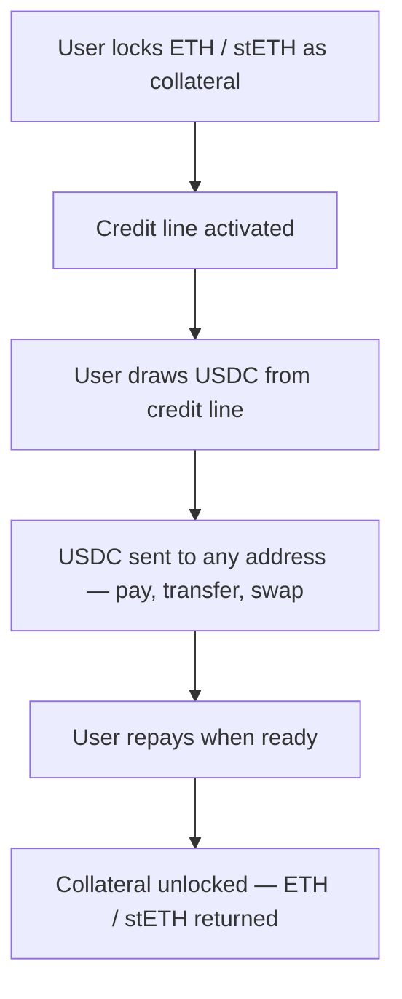

## Overview

If you run a wallet or super app, Sprinter Credit lets your users borrow USDC against their existing holdings — ETH, stETH, wstETH — without selling. Users lock collateral, get a credit line, and spend or transfer USDC while their assets stay productive.

Your wallet already has the signer. Sprinter provides the credit engine — you just execute the calldata it returns.

| Without Sprinter | With Sprinter |
|---|---|
| User sells ETH to get USDC | User locks ETH, draws USDC — keeps ETH exposure |
| stETH sits in wallet earning yield but illiquid | stETH earns yield **and** backs a spendable credit line |
| User bridges to get stablecoins on another chain | Cross-chain collateral — one credit line, any chain |
| No spending power without selling | Instant USDC credit against existing portfolio |

<div style={{ paddingRight: "120px" }}>

</div>

Every Sprinter endpoint returns `{ calls: ContractCall[] }` — unsigned transaction calldata. Your wallet signs and submits. No custody handoff.

## What You Need from Sprinter

| Your wallet handles | Sprinter handles |
|---|---|
| Wallet UX, account management | Collateral locking & credit line activation |
| Transaction signing & submission | USDC credit draws to any receiver address |
| Portfolio display, balance tracking | Health factor monitoring, LTV enforcement |
| Network switching, gas estimation | Earn vaults (collateral earns yield while locked) |
| User authentication | Repayment & collateral unlock |

## Supported Collateral

Users can lock assets they already hold. Each asset has its own LTV based on its risk profile:

| Asset | LTV | Collateral Tier | Notes |
|---|:---:|---|---|
| ETH | 80% | Raw volatile | Native ETH — highest liquidity |
| stETH | 75% | Volatile DEX-swap | Lido staked ETH — earns staking yield while locked |
| wstETH | 75% | Volatile DEX-swap | Wrapped stETH — same yield, no rebase |
| USDC | 90% | Raw stablecoin | Stablecoin — highest LTV |

Use `GET /credit/protocol` to fetch the latest supported assets and LTVs. See [Supported Assets](/sprinter-credit/supported-assets) for the full list and collateral tier framework.

## Before You Start

For most wallet integrations, users sign every transaction themselves — no delegation needed. A standard EOA (existing wallet) works out of the box.

If you want to support features like auto-repayment, scheduled draws, or agent-assisted actions, you'll need a delegation model. See [Credit Accounts](/sprinter-credit/credit-accounts) for EOA + Operator vs Smart Account trade-offs, and [Credit Operators](/sprinter-credit/policy-engine#credit-operators) for how delegation works.

## Integration

<Steps>
  <Step title="User Locks Collateral">
    When a user wants to borrow, they lock collateral from their wallet. The API returns calldata — your wallet signs and submits.

    <Tabs>
      <Tab title="Lock ETH">
        ```bash
        # Lock 1 ETH as collateral on Base
        curl -X GET 'https://api.sprinter.tech/credit/accounts/0xUSER/lock?amount=1000000000000000000&asset=0xETH_ADDRESS'
        ```
      </Tab>
      <Tab title="Lock stETH">
        ```bash
        # Lock stETH as collateral
        curl -X GET 'https://api.sprinter.tech/credit/accounts/0xUSER/lock?amount=1000000000000000000&asset=0xSTETH_ADDRESS'
        ```
      </Tab>
      <Tab title="Lock + Earn Vault">
        ```bash
        # Lock collateral and wrap into a yield-bearing vault
        curl -X GET 'https://api.sprinter.tech/credit/accounts/0xUSER/lock?amount=1000000000000000000&asset=0xCOLLATERAL&earn=STRATEGY_ID'
        ```
        The `earn` parameter wraps the asset into a yield-bearing vault — collateral earns while the credit line is active. Use `GET /credit/protocol` for available strategies.
      </Tab>
    </Tabs>

    Returns `{ calls: ContractCall[] }` — present to the user for signing. Once confirmed, the credit line is active.
  </Step>

  <Step title="Show Credit Position">
    After locking, display the user's credit position in your wallet UI.

    ```bash
    curl -X GET https://api.sprinter.tech/credit/accounts/0xUSER/info
    ```

    ```json
    {
      "data": {
        "USDC": {
          "totalCreditCapacity": "2400.00",
          "remainingCreditCapacity": "2400.00",
          "totalCollateralValue": "3000.00",
          "principal": "0",
          "interest": "0",
          "healthFactor": "Infinity",
          "dueDate": null
        }
      }
    }
    ```

    Key fields to surface in your UI:

    | Field | What to show |
    |---|---|
    | `remainingCreditCapacity` | Available to borrow |
    | `totalCollateralValue` | Total locked collateral value |
    | `principal` + `interest` | Outstanding debt |
    | `healthFactor` | Position health (warn below 1.5, danger below 1.2) |
    | `dueDate` | Repayment deadline |
  </Step>

  <Step title="User Draws USDC">
    When the user wants to borrow, draw USDC to any address — their own wallet, a merchant, a DEX, another wallet.

    ```bash
    curl -X GET 'https://api.sprinter.tech/credit/accounts/0xUSER/draw?amount=500000000&receiver=0xRECEIVER'
    ```

    | Parameter | Description |
    |---|---|
    | `account` | User's wallet address (borrower) |
    | `amount` | USDC amount (6 decimals — $500 = `500000000`) |
    | `receiver` | Any address — user's wallet, merchant, protocol |

    Returns `{ calls: ContractCall[] }` — user signs, USDC is delivered.

    <Info>
    A **0.50% origination fee** is deducted from each draw. See [Fees](/sprinter-credit/credit-engine#fees).
    </Info>
  </Step>

  <Step title="Repay & Unlock">
    Users repay debt to free their collateral. Anyone can repay on behalf of any account.

    ```bash
    # Check outstanding debt
    curl -X GET https://api.sprinter.tech/credit/accounts/0xUSER/info

    # Repay
    curl -X GET 'https://api.sprinter.tech/credit/accounts/0xUSER/repay?amount=500000000'

    # Unlock collateral
    curl -X GET 'https://api.sprinter.tech/credit/accounts/0xUSER/unlock?amount=1000000000000000000&asset=0xCOLLATERAL'
    ```

    Credit runs on a 30-day billing cycle with a 7-day grace period. See [Fees](/sprinter-credit/credit-engine#fees).
  </Step>
</Steps>

## UX Patterns

<Tabs>
  <Tab title="In-App Payments">
    If your wallet supports in-app payments, Sprinter Credit lets users pay with USDC drawn against their ETH/stETH — no selling required.

    **Flow:**
    1. User initiates a payment within your wallet
    2. Your app checks if the user has a Sprinter credit line with sufficient capacity
    3. If yes — draw USDC to the merchant/recipient via `/draw`
    4. User signs one transaction (the draw), payment is settled
    5. User repays later from any source

    **What happens after draw:** USDC lands directly in the merchant's or recipient's wallet. The payment is settled on-chain — no intermediary, no delay. The user paid with credit backed by their ETH, and the merchant received real USDC.

    This turns every ETH/stETH holder into a USDC spender without any sell pressure.
  </Tab>
  <Tab title="Portfolio Credit Line">
    Display Sprinter Credit as a feature within your wallet's portfolio view.

    **UX:**
    - Show "Available Credit" alongside token balances
    - "Borrow" button next to eligible collateral (ETH, stETH)
    - Health factor gauge with color coding (green → yellow → red)
    - Repayment reminder before due date

    **What happens after draw:** When the user draws, USDC arrives in their wallet instantly — ready to send, swap, or spend. It feels like unlocking liquidity that was always there, just locked up in ETH.

    Users treat it like an overdraft — they see available credit and draw when needed.
  </Tab>
  <Tab title="Buy Now, Pay Later">
    When a user tries to swap or purchase but lacks stablecoins, offer credit as an alternative to selling.

    **Flow:**
    1. User wants to buy an NFT / swap for a token but has no USDC
    2. Prompt: "Borrow $X against your ETH instead of selling?"
    3. User confirms → lock ETH, draw USDC, complete purchase
    4. User repays within 30 days

    **What happens after draw:** The USDC goes directly to the seller or protocol — the NFT lands in the user's wallet, the swap executes, the purchase completes. The user got what they wanted without selling a single asset. They repay on their own schedule.

    This prevents forced selling and keeps users' long positions intact.
  </Tab>
  <Tab title="Peer-to-Peer Transfers">
    Users can send USDC to friends, family, or other wallets — funded by their credit line instead of their token balance.

    **Flow:**
    1. User wants to send $200 to a friend but only holds ETH
    2. User draws USDC with the friend's address as the `receiver`
    3. USDC arrives in the friend's wallet — one transaction

    **What happens after draw:** The friend receives USDC directly — no intermediate step, no swap. The sender's ETH stays locked and earning yield. This makes credit-backed transfers as simple as a regular wallet send.
  </Tab>
  <Tab title="DeFi Access">
    Let users interact with DeFi protocols using borrowed USDC — provide liquidity, enter yield positions, or fund a DEX trade.

    **Flow:**
    1. User wants to provide liquidity on a DEX but doesn't want to sell ETH for the USDC side
    2. User draws USDC from their credit line
    3. USDC is used to enter the LP position alongside their existing tokens

    **What happens after draw:** The drawn USDC goes to the user's wallet or directly to a protocol address. The user is now earning LP fees on borrowed USDC while their ETH collateral continues earning staking yield — yield on both sides.
  </Tab>
</Tabs>

## Integration Notes

<AccordionGroup>
  <Accordion title="Health Monitoring" icon="heart-pulse">
    Poll `healthFactor` from the info endpoint and surface alerts in your wallet UI. A health factor approaching 1.0 means the position is close to liquidation — prompt the user to add collateral or repay. See [Risk Management](/sprinter-credit/risk-management).
  </Accordion>
  <Accordion title="Collateral Yield" icon="chart-line">
    Use the `earn` parameter when locking to wrap collateral into a yield-bearing vault. For stETH users, this means earning staking yield **and** vault yield simultaneously. Use `GET /credit/protocol` to discover available strategies.
  </Accordion>
  <Accordion title="No Custody" icon="lock">
    Sprinter returns unsigned calldata — the user's wallet signs everything. Sprinter never has access to user funds. This means your wallet integration doesn't change your custody model.
  </Accordion>
  <Accordion title="Account Type" icon="wallet">
    If your users sign every transaction themselves, a standard EOA (existing wallet) is all you need. If you want to enable delegated actions like auto-repayment or scheduled draws, you'll need to choose between an Operator contract or Smart Account. See [Credit Accounts](/sprinter-credit/credit-accounts) for the full comparison.
  </Accordion>
  <Accordion title="Volatile Collateral" icon="triangle-exclamation">
    ETH and stETH prices fluctuate. If collateral value drops, the health factor decreases and the user may face liquidation. Build alerts into your wallet UI — warn at health factor 1.5, strongly warn at 1.2.
  </Accordion>
  <Accordion title="Cross-Chain Collateral" icon="link">
    Users can lock collateral on any supported chain. Sprinter handles cross-chain accounting — one credit line across all chains. This means users don't need to bridge assets before borrowing.
  </Accordion>
</AccordionGroup>

## API Reference

Every step maps to a single Sprinter endpoint:

| Wallet Flow | Sprinter API |
|---|---|
| User locks collateral | `GET /credit/accounts/{account}/lock` |
| Lock + earn vault | `GET /credit/accounts/{account}/lock?earn=STRATEGY_ID` |
| Show credit position | `GET /credit/accounts/{account}/info` |
| Draw USDC | `GET /credit/accounts/{account}/draw?receiver={addr}` |
| Repay debt | `GET /credit/accounts/{account}/repay` |
| Unlock collateral | `GET /credit/accounts/{account}/unlock` |
| Get protocol config | `GET /credit/protocol` |

<CardGroup cols={3}>
  <Card title="Credit Draw" icon="money-bill-transfer" href="/quickstart/credit-draw">
    Core credit draw lifecycle — lock, draw, repay, unlock.
  </Card>
  <Card title="Supported Assets" icon="coins" href="/sprinter-credit/supported-assets">
    Full collateral list, LTVs, and earn strategies.
  </Card>
  <Card title="Credit API Reference" icon="bolt" href="/api-reference/sprinter/credit/get-credit-protocol-configuration">
    Full API reference with interactive playground.
  </Card>
</CardGroup>
