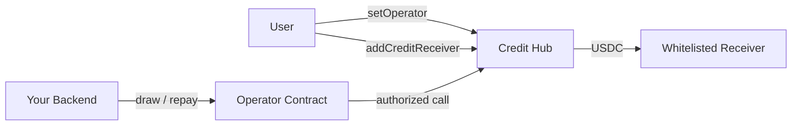

## Overview

The Policy Engine is what makes Sprinter credit _configurable_. Rather than one-size-fits-all credit, every credit line is governed by a policy that defines exactly who can use it, what they can do with it, and under what conditions.

The tighter the constraints, the less collateral is needed — because the protocol's downside risk is bounded. This is how Sprinter can offer favourable or even undercollateralised credit terms: not because the risk disappears, but because it is constrained.

## Credit Operators

Operators are the delegation primitive in Sprinter Credit. They allow a user to grant a third party — an app, a backend, an agent — the ability to act on their credit position without handing over custody.

### How Operators Work

An operator is a smart contract that sits between your backend and the user's credit position. The user opts in by calling `setOperator()` on the Credit Hub. From that point, the operator can execute actions on the user's behalf — but only within the bounds the operator contract enforces.

**Key trust properties:**
- Operators can **draw credit** to whitelisted receivers — they cannot touch or withdraw collateral
- Operators can **repay debt** on behalf of the user
- Users must explicitly **whitelist receivers** via `addCreditReceiver()` before an operator can draw to them
- **Revocation** is time-delayed (not instant) to prevent abuse during active billing cycles — a user cannot revoke mid-settlement and leave the integrator exposed



### Setting Up an Operator

<Steps>
  <Step title="Deploy the Operator Contract">
    Deploy an operator contract with your backend address as the authorized `caller`. You can use the existing [`ExclusiveOperator`](https://github.com/sprintertech/remote-collateral-contracts/blob/main/contracts/operator/ExclusiveOperator.sol) or build a custom one.

    ```solidity
    // ExclusiveOperator constructor
    constructor(address _caller, address _creditHub)
    ```

    The `caller` is the only address that can invoke actions through this operator.
  </Step>

  <Step title="User Opts In">
    The user calls `setOperator()` on the Credit Hub to authorize your operator contract on their credit position.

    ```solidity
    creditHub.setOperator(operatorContractAddress);
    ```
  </Step>

  <Step title="User Whitelists Receivers">
    The user calls `addCreditReceiver()` to whitelist the addresses that the operator can draw to (e.g. your settlement address).

    ```solidity
    creditHub.addCreditReceiver(settlementAddress);
    ```

    The operator can only draw to addresses the user has explicitly approved.
  </Step>

  <Step title="Execute Delegated Actions">
    Your backend calls the operator contract to draw credit or repay debt — no user signature needed.

    ```solidity
    // Draw credit to the whitelisted settlement address
    operator.openCreditLine(borrower, settlementAddress, amount);
    ```
  </Step>
</Steps>

### Existing Operators

| Operator | Description | Source |
|---|---|---|
| `ExclusiveOperator` | Single authorized caller, draw to whitelisted receivers only. Designed for card programs and simple delegation. | [View on GitHub](https://github.com/sprintertech/remote-collateral-contracts/blob/main/contracts/operator/ExclusiveOperator.sol) |

The `ExclusiveOperator` is the default choice for most integrations. It enforces a strict model: one caller (your backend), drawing only to receivers the user has whitelisted. No collateral access, no unauthorized destinations.

### Building Custom Operators

Custom operators let you encode your own business logic into the delegation layer. An operator contract must implement the operator interface and be registered with the Credit Hub.

**What you can customize:**
- **Multi-caller access** — allow multiple backends or agents to use the same operator
- **Amount caps** — enforce per-transaction or per-period draw limits on-chain
- **Time windows** — restrict when draws can happen (e.g. business hours only)
- **Co-sign requirements** — require an additional signature for draws above a threshold
- **Action restrictions** — allow only specific actions (e.g. draw but not repay, or repay but not draw)

### Operator Use Case Ideas

<AccordionGroup>
  <Accordion title="Card Program Settlement" icon="credit-card">
    Your backend is the sole caller. On each card swipe, it draws USDC to your settlement address. The user whitelists only your settlement address — funds can never go anywhere else.

    This is the standard `ExclusiveOperator` pattern used by card integrations like Kast.
  </Accordion>
  <Accordion title="Parental Controls" icon="user-shield">
    A parent sets up a credit position and assigns an operator that their child's wallet can draw from — but with on-chain caps. For example: max $50 per transaction, max $200 per week. The parent can adjust limits or revoke access at any time.
  </Accordion>
  <Accordion title="Agent Delegation" icon="robot">
    An AI agent is authorized as a caller on an operator with strict bounds: draw up to $500/day, only to a set of pre-approved protocol addresses. The agent can autonomously execute strategies (yield farming, rebalancing, DCA) within the guardrails the user defined.
  </Accordion>
  <Accordion title="Subscription Billing" icon="calendar">
    A SaaS or subscription service deploys an operator that can draw a fixed amount once per billing period. The user opts in, and the service draws automatically — like a crypto-native direct debit.
  </Accordion>
  <Accordion title="Team Treasury" icon="users">
    A DAO or team locks collateral and deploys a multi-caller operator. Multiple team members can draw from the shared credit line, each with individual caps. Co-sign requirements kick in above a threshold (e.g. draws over $10K require 2-of-3).
  </Accordion>
  <Accordion title="Automated Repayment" icon="rotate">
    An operator that monitors the user's credit position and automatically repays debt from a designated funding source before the due date — avoiding overdue interest. The user sets it and forgets it.
  </Accordion>
</AccordionGroup>

## Guardrailed Credit Accounts

Sprinter supports the creation of guardrailed credit accounts that grant Sprinter permissions on the issued funds. These accounts constrain how drawn credit can be used — for example, ensuring USDC can only be sent to a specific settlement address or swapped through an approved DEX router.

Guardrailed accounts are useful when the credit configuration requires usage constraints (see [Credit Configurations](/sprinter-credit/credit-engine#credit-configurations)). For instance, the Crosschain Intents configuration uses guardrailed accounts to ensure credit is only used for filling intents in supported protocols.

## Related

<CardGroup cols={3}>
  <Card title="Credit Accounts" icon="wallet" href="/sprinter-credit/credit-accounts">
    EOA vs Smart Account — choosing the right account type.
  </Card>
  <Card title="Credit Engine" icon="gear" href="/sprinter-credit/credit-engine">
    Credit line creation, drawdowns, health factors, and liquidations.
  </Card>
  <Card title="Risk Management" icon="shield" href="/sprinter-credit/risk-management">
    Liquidation mechanics and position monitoring.
  </Card>
</CardGroup>
