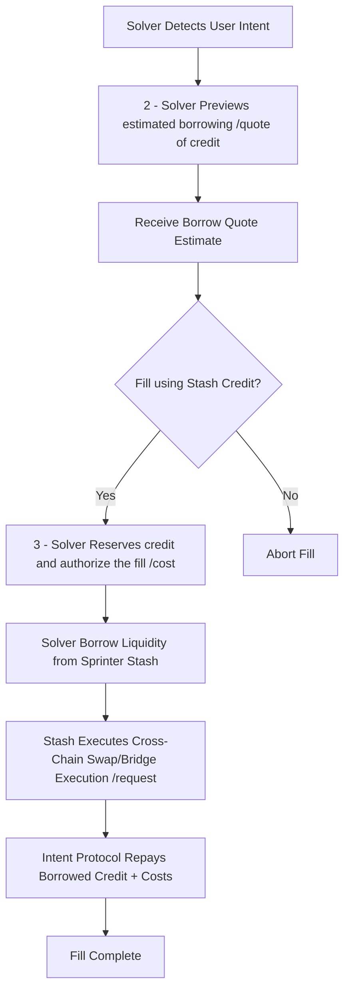

<Tip>
Request your Stash API key by dropping a Telegram DM to [@Sprinter_Intern_Bot](https://t.me/Sprinter_Intern_Bot) with `/request_api_key`
</Tip>

## For crosschain DeFi

Sprinter Stash enables solvers to **borrow crosschain credit on-demand** to execute user intents without needing pre-funded inventory.

## Overview of the Stash Fill Lifecycle

