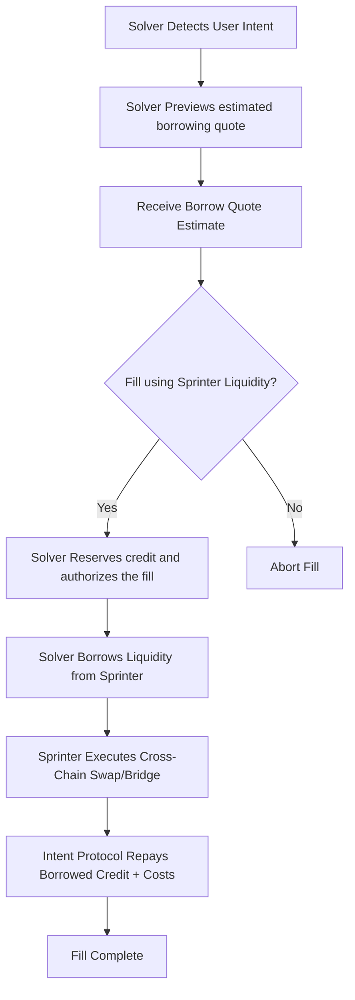

<Tip>
Request your Sprinter Liquidity API key by dropping a Telegram DM to [@Sprinter_Intern_Bot](https://t.me/Sprinter_Intern_Bot) with `/request api key`
</Tip>

## For crosschain DeFi

Sprinter Liquidity enables solvers to **borrow crosschain credit on-demand** to execute user intents without needing pre-funded inventory.

## Overview of the fill lifecycle

